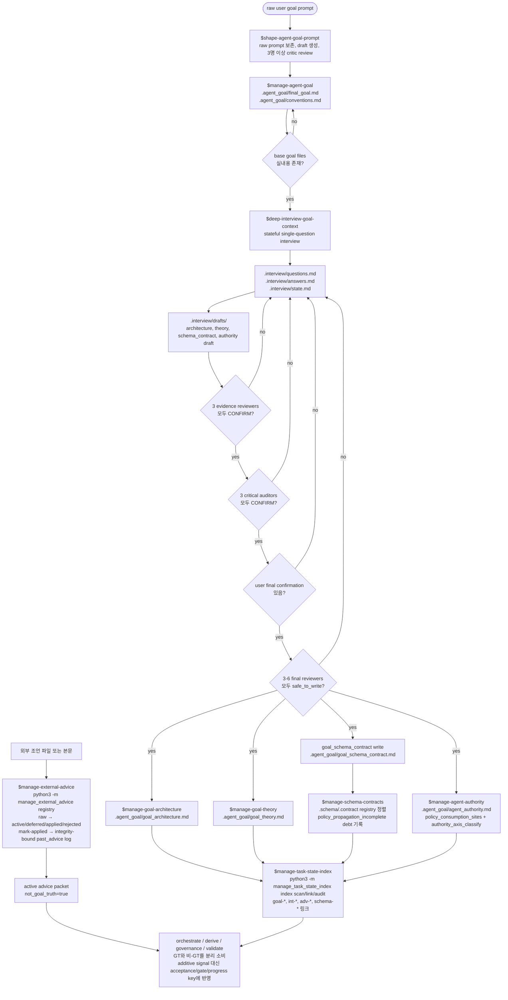
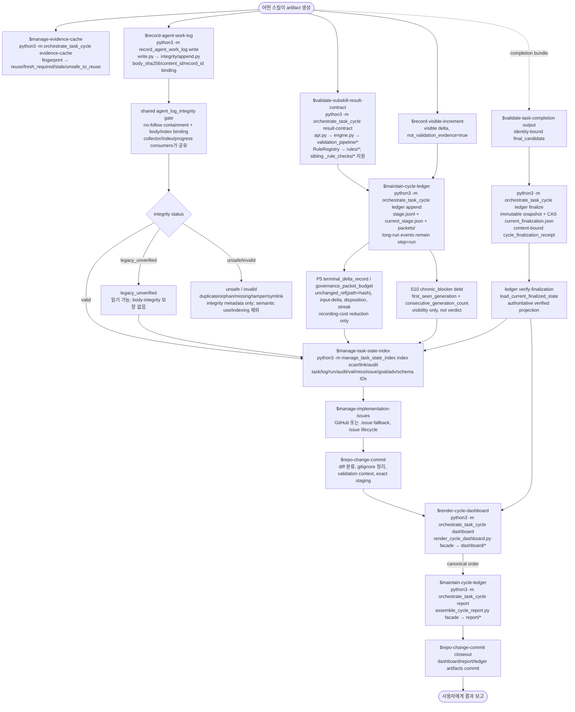
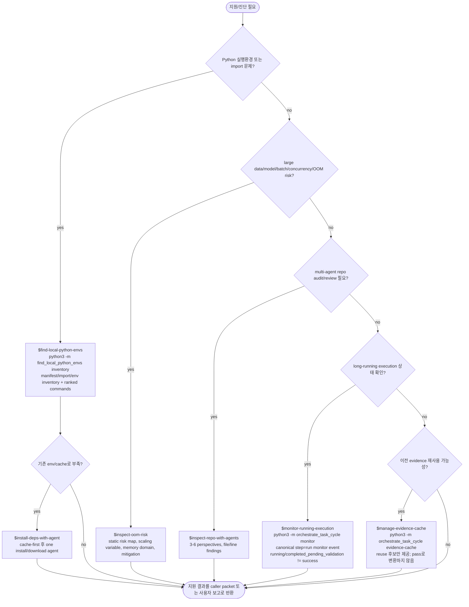
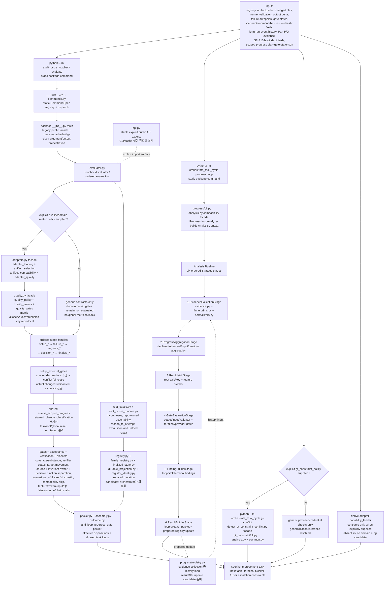
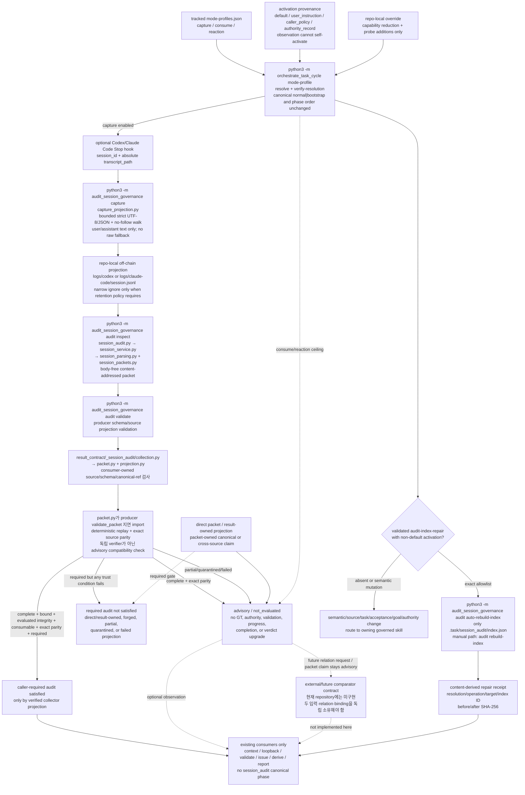

개인적으로 만든 워크플로우 목적의 스킬 모음입니다.

생각날때 업데이트합니다.

## Skill 작동 흐름도

이 섹션은 각 스킬이 어떤 입력을 읽고, 어떤 판단을 하며, 어떤 산출물을 만들고, 어느 다음 스킬로 넘어가는지 확인하기 위한 흐름도이다.

- Mermaid 블록은 렌더링 가능한 다이어그램이다.
- 순수 텍스트 블록은 Mermaid 렌더링 없이도 같은 논리를 읽을 수 있는 흐름도이다.
- `.agent_goal/*.md`는 장기 목표/권한/규칙의 GT로 취급한다.
- `.agent_advice/*`는 비-GT 방향성 문서로만 취급한다.
- `.task/*`, `.agent_log/*`, `.issue/*`, `.schema/*`, `.contract/*`, `.validation/*`는 워크플로우 증거와 추적 상태이다.
- `.agent_log`의 현재 형식은 Markdown 본문과 `index.jsonl`을 `body_sha256`, `content_id`, `record_id`로 결합한다. context/completion collector, task-state index, progress-loop consumer는 공통 no-follow integrity 검사 후에 읽으며, 변조·중복·orphan·missing·symlink는 의미 소비와 색인을 fail-close한다. collector는 진단을 위한 integrity/file metadata만 표면화할 수 있다. legacy 행은 `legacy_unverified`로 읽을 수 있지만 body-integrity 보장은 없다.
- `logs/codex/*`, `logs/claude-code/*`의 Stop-hook projection과 `.task/session_audit/*`는 선택적 off-chain 관찰 사이드카이다. raw fallback 없이 최소 user/assistant projection만 보존하며 GT·권한·검증·진전·완료 증거가 아니다. 저장소 retention policy가 요구할 때만 해당 local path를 좁게 ignore한다.
- required session audit는 coordinator-owned collector가 현재 source를 결정론적으로 재검증하고 complete·bound·evaluated-integrity·consumable 조건과 `source_projection_verified=true`를 모두 충족한 경우에만 통과한다. direct/result-owned packet과 packet-owned canonical/cross-source claim은 계속 advisory이며, 별도 comparator contract가 두 입력을 독립적으로 소유해 새 관계를 수립해야 한다.
- canonical workflow mode는 계속 `normal|bootstrap`뿐이다. 선택적 ModeSpec은 capture/consume/reaction 축을 조합하되 phase·권한·verdict·semantic artifact를 변경하지 않으며, unattended repair는 비-default activation을 거친 `.task/session_audit/index.json` 재생성만 허용한다.
- domain metric, alias, lexicon, threshold, generalization pattern, capability ladder는 명시적 repo adapter가 소유한다. quality policy가 없으면 domain metric gate는 `not_evaluated`, capability ladder가 없으면 domain rung은 unavailable, GT policy가 없으면 generalization inference는 disabled이다. generic provider/credential 검사는 계속 동작한다.
- 완료 판정은 `$validate-task-completion`이 담당하며, 실행 성공/로그/대시보드/인덱스만으로 완료를 선언하지 않는다.
- adapter나 caller가 verifier contract를 요구하는 measurable acceptance는 live verifier가 pass해야 완전하다. required verifier의 `not_evaluated`는 pass가 아니며, full close 대신 verifier follow-up, explicit descope, terminal blocker, user escalation 중 하나로 보존한다.
- acceptance가 참조하는 gate의 required hook 부재, `pass_with_unobserved_axes`, generation-dependent count key, below-policy residual value per cycle cost는 pass/advance/close 근거가 아니다. hook supply, axis supply, effective key/terminal-outcome fallback, residual descope plus next rung, terminal blocker, user escalation 중 하나로 보존한다.
- acceptance scenario coverage, full body-free `command_argv`, actionable blocker relation, stochastic feasibility는 해당 증거가 등장한 cycle에서 completion/advance 소비 전에 gate로 재확인한다. `scenario_uncovered`, `acceptance_inversion`, `command_provenance_missing`, repeated `blocker_opacity`, `predetermined_unreachable`, `floor_edge_envelope`는 같은 결함 재시도가 아니라 scenario/argv/blocker/contract repair, descope, terminal blocker, user escalation 중 하나로 보존한다.
- 구조 진전은 어댑터가 `structure_metrics.global_*` 전역 불변량을 제공하면 per-scope 감소가 아니라 global high-water 이동으로 판정한다.
- depth/fan-out는 단독 차단 신호가 아니며 cohesion, reuse-root import ratio, duplicate symbol, mechanical shard, repo-owned `code_convention_contract`와 결합될 때만 구조 부담으로 소비한다. same-directory numbered/flat sharding이나 `relocated_mechanical_shard`는 size-driven refactor 완료 근거가 아니다.
- Part P/Q 증거는 기존 흐름의 pass/advance 소비를 더 엄격하게 만든다. `feature_regressed_artifact`, fresh producer execution 부재, `condition_unsatisfiable_for_input_generation`, `diminishing_reprocess`, fabricated hook provenance, primary reason-code 미수리는 completion/progress 전에 inheritance repair, producer re-execution/input refresh, existing-capability wiring, hook/provenance repair, explicit descope, terminal blocker, user escalation 중 하나로 보존한다. `adapter_hook_debt`/`unenforced`는 honest missing-hook debt이고, `terminal_delta_record`와 `governance_packet_budget`는 반복 기록 비용만 줄이며 blocker, escalation, validation 의미를 약화하지 않는다.
- S7~S10은 기존 판정의 성립조건 보정이다. `target_metric_delta`가 `moved=false`를 반환하면 측정/프록시/observed 필드만으로 완료하지 않고, `policy_consumption_sites`의 미반영 site는 전파 부채로 남기며, `gate_artifact_compatibility=false`는 gate fail이 아니라 `not_evaluated` 스킵이다. `first_seen_generation`/`consecutive_generation_count`/`chronic_threshold`는 chronic blocker 부채를 보이게 할 뿐 완료/검증 verdict를 바꾸지 않는다.
- scoped progress는 기존 `--gate-state-json` 입력에서 추출해 공통 계약으로 재평가한다. 실제 retained change가 task-local이면 bounded task close만 허용하고 root/global stall은 reset하지 않는다. root reset은 동일 basis의 residual 감소와 독립 observation 또는 완전한 self-grounded replay가, global reset은 모든 active axis에 대해 source·invariant owner·decisive function이 분리된 exact-bound receipt가 필요하다. 상충하거나 malformed인 scoped 입력은 선언된 surface만 보존하고 positive movement는 만들지 않는다.
- `$plan-validation-scope`의 two-pass 경로는 `decision_artifact_ref`와 `verification_source_separation_gate`가 공급되면 plan에서 current identity와 source/invariant/function 분리를 검사하고, finalize에서 같은 decision subject/lineage의 최신 revision과 gate를 다시 요구한다. plan 결함은 `affected_chain` 이상으로 올려 warn하고, finalize의 누락·stale·subject 변경·coupling은 fail-close한다.
- 장기 실행은 새 canonical phase가 아니라 `step: run`의 분기이다. `event_kind: long_run_launch|long_run_monitor|long_run_harvest|long_run_finalize`와 `long_run_role: launch|monitor|harvest|finalize`를 기록하며, `running`과 `completed_pending_validation`은 성공이 아니라 남은 harvest/validation의 증거이다.
- 스킬 실행 진입점은 스킬별 underscore 패키지의 `python3 -m <package> <command>` 형식으로 통일한다. 평면 `scripts/*.py` 호환 shim은 두지 않으며, 패키지 내부는 명시적 import와 정적 명령 레지스트리를 사용한다.

### 스크립트 모듈 아키텍처

- 각 `SKILL.md`는 자신의 `scripts/` 디렉터리를 `PYTHONPATH`에 추가하는 composition root이며, 외부 공개 진입점은 패키지의 `__main__.py` 하나이다.
- 루트 명령은 정적 `CommandSpec` 레지스트리에서 명시적으로 선택한다. 명령 이름 중복은 import 시 차단하고, 런타임 파일 탐색이나 `globals()` 기반 자동 등록은 사용하지 않는다.
- 상태 저장과 검증은 Repository/Unit-of-Work 경계로 분리하고, 분석 흐름은 작은 Stage/Strategy를 조합하는 Pipeline으로 구성한다. 상속은 상태 공유용 mixin 대신 안정된 추상 계약이나 `Protocol`이 실제 대체 가능성을 제공할 때만 사용한다.
- 생산자와 독립 검증자는 공개 스키마와 content-bound receipt를 경계로 상호작용한다. 예외적으로 session-audit consumer는 source parity를 재현하기 위해 producer의 `validate_packet`을 지연 호출하지만, 그 replay를 독립 신뢰나 verdict 승격으로 취급하지 않고 consumer-owned schema/source/canonical-ref 검사와 함께 advisory로 제한한다.
- 기능별 하위 패키지는 `api`/`cli` 또는 `command_registry` facade, 도메인 서비스, 저장소, 검증기, 렌더러를 분리한다. 공용 `utils.py`, 번호·버전 접미사 shard, wildcard import, 내부 `sys.path` 수정은 금지한다.
- 구조 회귀 테스트는 평면 production 진입점 부재, 임의 작업 디렉터리의 `python3 -m` 실행, 파일·함수 크기 상한, 정적 import/명령 레지스트리, 기존 출력·스키마 회귀를 함께 확인한다.

| 스킬 | 공개 패키지 | 루트 명령 |
|---|---|---|
| `audit-cycle-loopback` | `audit_cycle_loopback` | `evaluate` |
| `audit-session-governance` | `audit_session_governance` | `capture`, `audit` |
| `build-validation-set-with-agents` | `build_validation_set_with_agents` | `build`, `run-oracles`, `leakage`, `finalize`, `validate`, `freeze`, `verify-root` |
| `find-local-python-envs` | `find_local_python_envs` | `inventory` |
| `manage-agent-authority` | `manage_agent_authority` | `receipt` |
| `manage-external-advice` | `manage_external_advice` | `registry` |
| `manage-task-state-index` | `manage_task_state_index` | `index`, `migrate`, `verify-migration` |
| `normalize-acceptance-and-demo` | `normalize_acceptance_and_demo` | `identity` |
| `orchestrate-task-cycle` | `orchestrate_task_cycle` | `ledger`, `transition`, `packet`, `context`, `report`, `dashboard`, `result-contract`, `task-pack`, `progress-loop`, `gt-conflict`, `evidence-cache`, `mode-profile`, `model-effort`, `monitor`, `output-delta`, `efficiency`, `visible-increment`, `code-structure`, `changed-surface`, `validation-scope` |
| `plan-validation-scope` | `plan_validation_scope` | `changed-surface`, `plan`, `finalize` |
| `record-agent-work-log` | `record_agent_work_log` | `write`, `migrate`, `verify-migration` |
| `run-task-code-and-log` | `run_task_code_and_log` | `failure-autopsy` |
| `validate-task-completion` | `validate_task_completion` | `collect-evidence` |

각 스킬은 `PYTHONPATH="$SKILLS_ROOT/<skill>/scripts" python3 -m <package> <command>`로 호출한다. 다른 스킬의 공개 API를 소비하는 경우 해당 스킬의 `scripts/` 루트만 `PYTHONPATH`에 추가한다.

#### 확장 지점과 적용 규칙

1. 루트 명령을 추가할 때는 해당 패키지의 composition root에 명시적 handler와 `CommandSpec` 한 개를 등록한다. 파일명 탐색, `globals()`, `getattr()` 기반 dispatch는 사용하지 않는다.
2. 분석 단계를 추가할 때는 입력·누적 상태를 typed Context/State로 전달하고, 작은 `Protocol`/Strategy 구현을 정해진 Pipeline 순서에 삽입한다. 순서 자체가 출력 계약인 경우 registry tuple과 회귀 테스트에서 함께 고정한다.
3. 결과 계약을 확장할 때만 안정된 `ContractRule` 계층을 상속하고, 대상별 rule을 `RuleRegistry`에 등록한다. 상태 공유를 위한 mixin 다중 상속은 사용하지 않으며, 기존 rule을 바꾸지 않고 새 target을 추가할 수 있어야 한다.
4. durable write는 Repository와 Unit-of-Work 경계에서 prepare/commit/rollback을 분리한다. producer와 verifier는 공개 schema, hash, receipt를 기준으로 검증한다. session-audit producer replay처럼 명시적으로 허용된 호환 경로는 독립 검증 근거가 아니라 재현성 보조 신호로만 소비한다.
5. facade는 기존 import 심볼과 CLI를 유지하고 구현 세부사항은 하위 모듈로 위임한다. 새 확장에는 임의 cwd 모듈 호출, 출력 동등성, fail-close, 크기 상한 테스트를 함께 추가한다.

### Mermaid Flowchart 0: 현재 패키지·모듈 composition

```mermaid
flowchart TB
  Skill["SKILL.md<br/>scripts/ 경로를 PYTHONPATH에 추가"]
  Main["&lt;package&gt;/__main__.py<br/>공개 module entrypoint"]
  Registry["cli.py 또는 command_registry.py<br/>정적 CommandSpec / explicit handler"]

  Skill --> Main --> Registry

  subgraph Orchestrator["orchestrate_task_cycle composition root"]
    OCLI["orchestrate_task_cycle/cli.py<br/>20개 정적 root command"]
    Ledger["ledger<br/>cycle_ledger.py facade → ledger/*<br/>Repository + finalization Unit-of-Work"]
    Transition["transition<br/>validate_cycle_transition.py facade → transition/*<br/>ValidationContext + 21 ordered stages"]
    Packet["packet<br/>render_subskill_packet.py facade → packet/*<br/>PacketBuildContext + static target registry"]
    Reporting["dashboard / report<br/>facade → dashboard/* / report/*<br/>typed builder pipelines"]
    Result["result-contract<br/>result_contract/api.py → engine + validation_pipeline/*<br/>RuleRegistry → rules/*; sibling _rule_checks/* 지원"]
    Progress["progress-loop<br/>progress/cli.py → AnalysisContext + AnalysisPipeline<br/>evidence → aggregation → roots → gates → findings → result"]
    TaskPack["task-pack<br/>task_pack/cli.py → validation / mutation / receipts<br/>content-addressed transaction boundary"]
    Analysis["code-structure / efficiency / output-delta / gt-conflict / model-effort<br/>compatibility facade → typed responsibility package"]
    Support["context / evidence-cache / mode-profile / monitor<br/>visible-increment / changed-surface / validation-scope<br/>public facade → responsibility module"]
    OCLI --> Ledger
    OCLI --> Transition
    OCLI --> Packet
    OCLI --> Reporting
    OCLI --> Result
    OCLI --> Progress
    OCLI --> TaskPack
    OCLI --> Analysis
    OCLI --> Support
  end

  Registry --> OCLI

  subgraph SiblingPackages["독립 skill packages"]
    Loopback["audit_cycle_loopback evaluate<br/>commands.py → package __init__.py facade/cache bridge<br/>→ cli.py → evaluator.py + evaluation_stages/*"]
    Session["audit_session_governance capture / audit<br/>capture_projection.py + session_service.py<br/>session_parsing.py + session_packets.py"]
    Durable["record_agent_work_log / manage_task_state_index<br/>writer·index facade → integrity / migration / verifier<br/>producer와 verifier 구현 독립"]
    Validation["build_validation_set_with_agents / plan_validation_scope<br/>build·leakage·run-oracles·finalize·validate<br/>changed-surface·plan·finalize"]
    Leaf["authority / advice / acceptance / env / completion<br/>정적 command registry → 도메인 facade"]
  end

  Registry --> Loopback
  Registry --> Session
  Registry --> Durable
  Registry --> Validation
  Registry --> Leaf

  Ledger --> Artifacts[".task/cycle/* + content-bound receipt"]
  Result --> Artifacts
  TaskPack --> Artifacts
  Durable --> DurableArtifacts[".agent_log/* + .task/index.*"]
  Session --> SessionArtifacts["off-chain projection + .task/session_audit/*"]
  Loopback --> LoopArtifacts["anti_loop_progress_gate + prepared mutation candidate"]
```



### Mermaid Flowchart 1: 전체 task cycle orchestration

```mermaid
flowchart TD
  Start([사용자 요청 또는 cycle 시작])
  Context["python3 -m orchestrate_task_cycle context<br/>README, task.md, .agent_goal, .agent_log,<br/>.task, .issue, .schema, .contract, .validation 수집"]
  LedgerInit["$maintain-cycle-ledger<br/>python3 -m orchestrate_task_cycle ledger init<br/>initialization.json + current_stage.json + packets/ 생성<br/>첫 canonical context append 시 stage.jsonl 생성"]
  Authority["$manage-agent-authority<br/>권한/외부 호출/검증 우선순위 정책 요약<br/>S8 policy propagation + S5 authority axis"]
  Acceptance["$normalize-acceptance-and-demo<br/>python3 -m normalize_acceptance_and_demo identity<br/>acceptance, non-goals, demo, validation commands 정규화<br/>measurable → verifier / movement / scenario / freshness contract"]
  AdapterScan["repo-local skill adapter scan<br/>code_convention_contract + consumer-probe declarations,<br/>quality_delta_policy, gt_constraint_policy, capability_ladder,<br/>verifier/metric/axis/compatibility/feature/lineage hooks<br/>missing quality policy => domain metrics not_evaluated"]
  RoutePlan["route_plan<br/>task.md 존재 여부와 cycle 경로 결정"]

  PacketGate["각 major call 전: orchestrate_task_cycle packet<br/>render_subskill_packet.py → PacketBuilder + TARGET_BUILDERS"]
  TransitionGate["orchestrate_task_cycle transition<br/>누적 --stage + 별도 --routing-json<br/>transition/pipeline.py ordered validation"]
  OwningCall["target owning skill / deterministic helper 실행"]
  ResultGate["major result 후: orchestrate_task_cycle result-contract<br/>SessionAuditRule + RuleRegistry target rules"]
  LedgerAppend["orchestrate_task_cycle ledger append<br/>검증된 stage envelope 기록"]

  NoTask{"task.md 없음?"}
  DeriveInitial["$derive-improvement-task initial_init<br/>초기 task.md 생성"]
  SchemaPreInit["$manage-schema-contracts<br/>초기 task가 schema/contract 영향이면 계약 정렬"]

  ValPlan["$plan-validation-scope<br/>python3 -m plan_validation_scope plan<br/>current_only / affected_chain / full_chain 결정<br/>current decision identity + source/invariant/function 분리 검사<br/>결함은 warn + affected_chain floor"]
  ValSetPlan["$build-validation-set-with-agents planning workflow<br/>package build 입력으로 oracle/split/leakage 정책 공급<br/>plan/consume은 CLI root command가 아님"]
  Governance["$task-md-agent-governance<br/>task.md 구현, worker 위임, repo audit, task_miss 기록"]
  ResultContract1["$validate-subskill-result-contract<br/>python3 -m orchestrate_task_cycle result-contract<br/>result_contract/api.py → engine + validation_pipeline/*<br/>RuleRegistry → rules/*; sibling _rule_checks/* 지원"]
  AdapterValidate["repo_skill_adapter_validate<br/>load/signature/return contract +<br/>consumer_context_conformance 검증"]
  CodeStructure["python3 -m orchestrate_task_cycle code-structure<br/>code_structure_audit.py facade → code_structure/cli.py<br/>audit pipeline → aggregation/state/report<br/>구조/컨벤션/semantic modularity packet"]
  Run["$run-task-code-and-log<br/>명령 실행, full command_argv, 실패 autopsy,<br/>observed_producer_claim downgrade,<br/>.agent_log v3 content-bound 기록, long_run_launch 가능"]
  Running{"run status = running?"}
  Monitor["$monitor-running-execution<br/>python3 -m orchestrate_task_cycle monitor<br/>canonical step=run + event_kind long_run_*<br/>PID/log/heartbeat/artifact/remaining_validation 추적"]
  Quality["$review-cycle-output-quality<br/>단일 read-only xhigh 출력 품질 리뷰<br/>goal-axis completeness, landed_feature_inventory,<br/>feature_presence_evidence body anchor<br/>applicable hook result id+digest가 final decision에 소비됐는지 확인"]
  Loopback["$audit-cycle-loopback<br/>semantic_progress, same-family loop, explicit quality/domain metrics,<br/>3-state gates, verifier contract, count-key hygiene,<br/>scoped retained change → task/root/global reset 분리,<br/>source + invariant owner + decisive function separation,<br/>gate/artifact compatibility skip, chronic blocker debt,<br/>goal-axis completeness, residual cost ratio,<br/>scenario/argv/blocker/stochastic findings,<br/>feature regression, frozen input, self-resolvable input routing,<br/>audit_cycle_loopback packet + root-cause ledger"]
  ValSetBuild["python3 -m build_validation_set_with_agents<br/>build → leakage → run-oracles → finalize → validate<br/>선택적 frozen root: freeze → verify-root"]
  SchemaPreDerive["$manage-schema-contracts pre-derive<br/>schema/contract 영향, stale contract,<br/>S8 policy propagation debt 확인"]
  Visible["$record-visible-increment<br/>보이는 변화 기록; not_validation_evidence=true"]
  GapAnalysis["repo_skill_gap_analysis<br/>adapter/skill gap 또는 skill-creator 후보"]
  Profile["$profile-cycle-efficiency<br/>python3 -m orchestrate_task_cycle efficiency<br/>cycle_efficiency/* typed analysis pipeline<br/>중복 로그, metadata-only 반복, command surface budget 감지"]
  ScopeFinalize["$plan-validation-scope finalize<br/>실제 changed files + current decision_artifact_ref +<br/>verification_source_separation_gate 재검증<br/>누락/stale/subject 변경/coupling은 block<br/>계획 profile보다 낮출 수 없음"]
  IndexPre["python3 -m manage_task_state_index index scan<br/>pre-validation task/run/validation evidence scan"]
  Slice["$optimize-task-slice<br/>state_transition, batch, evidence_supply, verifier_completion,<br/>scenario_supply, command_provenance_repair,<br/>feature/freshness/frozen-input repair, consolidation 등 advisory"]
  DeriveNext["$derive-improvement-task<br/>다음 task.md 또는 task_pack/terminal blocker 도출"]
  SchemaPost["$manage-schema-contracts post-derive<br/>새 task/schema/contract 링크 정리"]
  Index["$manage-task-state-index<br/>python3 -m manage_task_state_index index scan/link/audit<br/>task/candidate/miss/log/schema/issue IDs"]
  Validate["$validate-task-completion<br/>complete / partial / failed + progress_verdict<br/>required verifier pass + target metric movement,<br/>structure global effect 확인<br/>evidence freshness, landed feature inheritance,<br/>adapter hook provenance, frozen input lineage gate"]
  FinalCandidate["identity-bound final_candidate<br/>six verdict axes + attempt/revision binding"]
  LedgerFinalize["orchestrate_task_cycle ledger finalize<br/>immutable snapshot + CAS current_finalization.json<br/>content-bound cycle_finalization_receipt"]
  FinalVerify["orchestrate_task_cycle ledger verify-finalization<br/>current receipt/snapshot 재검증<br/>authoritative_final projection"]
  Issue["$manage-implementation-issues<br/>issue open/update/resolve, .issue mirror, GitHub fallback"]
  Pending{"long-run 결과가 아직 pending?"}
  Commit["$repo-change-commit<br/>coherent implementation/checkpoint commit"]
  Dashboard["$render-cycle-dashboard<br/>python3 -m orchestrate_task_cycle dashboard<br/>render_cycle_dashboard.py facade → dashboard/*"]
  Report["$maintain-cycle-ledger<br/>python3 -m orchestrate_task_cycle report<br/>assemble_cycle_report.py facade → report/*"]
  Closeout["$repo-change-commit closeout<br/>report/dashboard/ledger closeout commit"]
  End([cycle 결과 보고])

  Start --> Context --> LedgerInit --> Authority --> NoTask
  NoTask -- yes --> DeriveInitial --> SchemaPreInit --> Context
  NoTask -- no --> AdapterScan --> Acceptance --> RoutePlan --> ValPlan
  LedgerInit -. each major call .-> PacketGate --> TransitionGate --> OwningCall --> ResultGate --> LedgerAppend
  LedgerAppend -. next target .-> PacketGate
  ValPlan --> ValSetPlan --> Governance --> ResultContract1 --> AdapterValidate --> CodeStructure --> Run --> Running
  Running -- yes --> Monitor --> ScopeFinalize
  Running -- no --> Quality --> Loopback --> ValSetBuild --> Visible --> GapAnalysis --> Profile --> ScopeFinalize
  ScopeFinalize --> IndexPre --> Validate --> FinalCandidate --> LedgerFinalize --> FinalVerify --> Issue --> Pending
  Pending -- yes --> Dashboard
  Pending -- no --> SchemaPreDerive --> Slice --> DeriveNext --> SchemaPost --> Index --> Commit --> Dashboard
  FinalVerify -. verified truth .-> Dashboard
  Dashboard -->|canonical order| Report --> Closeout --> End
```



### Mermaid Flowchart 2: goal, authority, interview, advice



### Mermaid Flowchart 3: task selection, doctoring, task-pack, anti-loop

```mermaid
flowchart TD
  Trigger([next task 필요 또는 명시적 task doctor 요청])
  ExplicitDoctor{"명시적 doctor/replace/pack 지시?"}
  TaskDoctor["$task-doctor<br/>task.md retarget/replace 또는 task_pack proposal"]
  DoctorRead["읽기: task.md, .agent_goal, named advice, .task, .issue, .schema"]
  DoctorArchive["$record-agent-work-log<br/>old task를 past_task로 보존"]
  DoctorWrite["새 task.md 또는 .task/task_pack/*.json + *.md 작성"]
  DoctorIndex["$manage-task-state-index<br/>supersedes, promoted_from_pack, advice links"]
  DoctorCommit["$repo-change-commit<br/>task-direction change commit"]

  NormalDerive["$derive-improvement-task"]
  Inputs["입력 수집<br/>.agent_goal, authority, active advice, .issue,<br/>task_miss, candidates, task_pack, schema/contract,<br/>qualitative_review, loopback, validation/profile packets"]
  Alignment["$inspect-repo-with-agents<br/>goal/convention/schema alignment"]
  MissAgents["2-4 task_miss analysis agents"]
  CandidateScan[".task/candidate_task 분류<br/>now/blocked/obsolete/duplicate"]
  PackScan[".task/task_pack 분류<br/>promote/insert/reorder/skip/supersede/terminal"]
  IssueFit["$manage-implementation-issues issue-fit agent<br/>fit/partial/misfit/unknown"]
  ImproveAgents["3 parallel improvement-analysis agents<br/>goal fit, architecture fit, miss/risk fit"]
  Synthesis["1 xhigh synthesis agent<br/>한 개 task 또는 terminal blocker 선택"]
  Decision{"선택 결과"}
  ArchivePast["$record-agent-work-log<br/>기존 task.md past_task archive"]
  WriteTask["task.md 작성<br/>Execution Environment 최상단 포함"]
  MutatePack["task_pack transaction<br/>create/promote/insert/reorder/skip/supersede/terminal"]
  Candidates["unselected proposals -> .task/candidate_task/<br/>selected candidate는 task 작성 후 삭제"]
  Terminal["terminal_blocker / user_escalation<br/>sealed family와 missing input 기록"]
  DeriveIndex["python3 -m manage_task_state_index index scan<br/>then index audit"]

  LoopInputs["run + quality review + output-delta artifacts<br/>failure autopsy, runner validation, gate states,<br/>long-run history, scenario/argv/blocker/stochastic,<br/>Part P/Q freshness, feature, lineage, provenance fields,<br/>S7-S10 movement/propagation/compat/chronic fields,<br/>scoped progress + actual changed-file/content evidence"]
  ProgressDetect["python3 -m orchestrate_task_cycle progress-loop<br/>progress/cli.py → AnalysisContext + AnalysisPipeline<br/>evidence → aggregation → roots → gates → findings → result"]
  Loopback["$audit-cycle-loopback<br/>python3 -m audit_cycle_loopback evaluate<br/>commands.py → package facade/cache → cli.py → evaluator.py<br/>api.py는 별도 stable explicit export facade"]
  LoopGate["anti_loop_progress_gate<br/>effective_allowed_dispositions, allowed_task_kinds,<br/>adapter_wiring_defect, adapter_mandate,<br/>failure surface, source+invariant+function separation,<br/>scoped retained change + task/root/global reset permissions,<br/>acceptance/verifier/axis/count-key/scenario gates,<br/>gate compatibility skip, chronic blocker debt,<br/>feature regression, frozen input, self-resolvable input,<br/>reason-code rank, structure global invariant metrics"]
  LongRunDebt{"active long_run_branch<br/>pending final output?"}
  LongRunRoute["derive constraint<br/>monitor/harvest/finalize same run_id<br/>or terminal/user escalation"]
  ScopedDebt{"scoped progress surface가<br/>root/global reset을 block?"}
  ScopedRoute["preserve bounded task close only<br/>retain root/global stall and route evidence repair"]
  VerifierDebt{"required verifier<br/>not_evaluated?"}
  VerifierRoute["derive constraint<br/>verifier hook/metric correction/descope/<br/>terminal blocker/user escalation"]
  EvidenceDebt{"scenario/argv/blocker/stochastic<br/>repair required?"}
  EvidenceRoute["derive constraint<br/>scenario_supply / command_provenance_repair /<br/>blocker_contract_repair / contract revision"]
  MetricMoveDebt{"target metric movement<br/>missing or false?"}
  MetricMoveRoute["derive constraint<br/>real target-metric movement / measurement repair<br/>or explicit residual/descope"]
  PolicyDebt{"policy propagation<br/>incomplete?"}
  PolicyRoute["derive constraint<br/>update unreflected judgment site<br/>or keep propagation=unverified debt"]
  PartPDebt{"Part P freshness/feature/<br/>frozen-input debt?"}
  PartPRoute["derive constraint<br/>inheritance repair / producer re-execution /<br/>input refresh / descope / terminal / escalation"]
  PartQDebt{"Part Q self-resolvable/provenance/<br/>reason-rank debt?"}
  PartQRoute["derive constraint<br/>existing-capability wiring / hook provenance repair /<br/>primary reason repair / structure handoff"]
  GlobalInvariant{"structure global invariant<br/>metrics present?"}
  GlobalMoved{"global high-water<br/>moved?"}
  GlobalRoute["global invariant present + local-only reduction<br/>cannot consume global structure target"]
  Slice["$optimize-task-slice<br/>state_transition/batch/evidence/verifier_completion/<br/>scenario_supply/command_provenance_repair/consolidation advisory"]
  Profile["$profile-cycle-efficiency<br/>sprawl, duplicate evidence, safety_only loops"]

  Trigger --> ExplicitDoctor
  ExplicitDoctor -- yes --> DoctorRead --> TaskDoctor --> DoctorArchive --> DoctorWrite --> DoctorIndex --> DoctorCommit
  ExplicitDoctor -- no --> NormalDerive
  LoopInputs --> ProgressDetect --> Loopback --> LoopGate --> LongRunDebt
  LongRunDebt -- yes --> LongRunRoute --> NormalDerive
  LongRunDebt -- no --> ScopedDebt
  ScopedDebt -- yes --> ScopedRoute --> NormalDerive
  ScopedDebt -- no or absent --> VerifierDebt
  VerifierDebt -- yes --> VerifierRoute --> NormalDerive
  VerifierDebt -- no --> EvidenceDebt
  EvidenceDebt -- yes --> EvidenceRoute --> NormalDerive
  EvidenceDebt -- no --> MetricMoveDebt
  MetricMoveDebt -- yes --> MetricMoveRoute --> NormalDerive
  MetricMoveDebt -- no --> PolicyDebt
  PolicyDebt -- yes --> PolicyRoute --> NormalDerive
  PolicyDebt -- no --> PartPDebt
  PartPDebt -- yes --> PartPRoute --> NormalDerive
  PartPDebt -- no --> PartQDebt
  PartQDebt -- yes --> PartQRoute --> NormalDerive
  PartQDebt -- no --> GlobalInvariant
  GlobalInvariant -- no --> Slice
  GlobalInvariant -- yes --> GlobalMoved
  GlobalMoved -- no --> GlobalRoute --> NormalDerive
  GlobalMoved -- yes --> Slice --> NormalDerive
  Profile --> NormalDerive
  NormalDerive --> Inputs --> Alignment --> MissAgents --> CandidateScan --> PackScan --> IssueFit --> ImproveAgents --> Synthesis --> Decision
  Decision -- standalone task --> ArchivePast --> WriteTask --> Candidates --> DeriveIndex
  Decision -- pack mutation --> ArchivePast --> MutatePack --> WriteTask --> DeriveIndex
  Decision -- no viable task --> Terminal --> DeriveIndex
```



### Mermaid Flowchart 4: implementation, execution, validation

```mermaid
flowchart TD
  Task([active task.md])
  Acceptance["$normalize-acceptance-and-demo<br/>python3 -m normalize_acceptance_and_demo identity<br/>acceptance_identity.py → normalized packet<br/>verifier/movement/scenario/freshness/hook contract"]
  ValScope["$plan-validation-scope<br/>python3 -m plan_validation_scope plan<br/>validation_scope.py → current_only/affected_chain/full_chain<br/>current decision identity + source/invariant/function 분리<br/>결함은 warn + affected_chain floor"]
  EnvNeed{"Python/dependency constrained?"}
  FindEnv["$find-local-python-envs<br/>python3 -m find_local_python_envs inventory<br/>local env inventory + ranked run commands"]
  DepMissing{"필수 dependency/cache 없음?"}
  Install["$install-deps-with-agent<br/>find-local-python-envs 후 exactly one install agent"]
  ValSetNeed{"validation set 필요?"}
  ValSet["$build-validation-set-with-agents<br/>python3 -m build_validation_set_with_agents<br/>build → leakage → run-oracles → finalize → validate<br/>optional freeze → verify-root; planning은 workflow mode"]
  Governance["$task-md-agent-governance"]
  ReadTask["task.md, authority, advice, schema, code_convention_contract 읽기"]
  MapRepo["repo map<br/>git status, rg --files, manifests, tests"]
  Workers["Tier 2-3 configured balanced-profile workers<br/>medium/high, disjoint write scopes, authority/advice/convention 포함"]
  Integrate["worker changes 통합<br/>format/tests, convention_conformance 확인"]
  Inspect["$inspect-repo-with-agents<br/>3-6 read-only code/schema/authority/generalization audit"]
  CodeStructure["python3 -m orchestrate_task_cycle code-structure<br/>code_structure_audit.py facade → code_structure/cli.py<br/>audit.py → aggregation.py + state.py + report.py<br/>contracts/source/semantics 지원"]
  TaskMiss[".task/task_miss report<br/>miss/resolved/deleted cleanup evidence"]
  Run["$run-task-code-and-log"]
  Execute["정해진 command 실행<br/>validation_profile 준수<br/>full body-free command_argv 보존"]
  Failure{"실패 또는 gate unsatisfiable?"}
  Autopsy["python3 -m run_task_code_and_log failure-autopsy<br/>safe_failure_autopsy.py + failure_diagnostics.py<br/>stage ladder + scalar diagnostics + gate selfcheck"]
  Log["$record-agent-work-log<br/>python3 -m record_agent_work_log write<br/>write.py → integrity/append.py<br/>content-bound .agent_log + index.jsonl"]
  Running{"long-running authorized?"}
  Monitor["$monitor-running-execution<br/>python3 -m orchestrate_task_cycle monitor<br/>step=run long_run_* event<br/>completed_pending_validation != success"]
  Quality["$review-cycle-output-quality<br/>single reviewer, output quality/delta/no-overclaim<br/>goal-axis completeness + landed_feature_inventory<br/>feature_presence_evidence body anchor<br/>hook result id+digest + final-decision consumption gate"]
  ScopeFinalize["$plan-validation-scope finalize<br/>actual changed files + current decision_artifact_ref +<br/>verification_source_separation_gate<br/>missing/stale/subject change/coupling은 block"]
  Completion["$validate-task-completion<br/>python3 -m validate_task_completion collect-evidence<br/>completion gate가 evidence bundle 소비"]
  Gates["gates: env, execution, repo audit, OOM if relevant,<br/>task_miss, issue, advice, schema, acceptance,<br/>required verifier/hook pass, target metric movement,<br/>goal axes, scenario, command, blocker, stochastic feasibility,<br/>policy propagation debt, gate compatibility skip,<br/>evidence freshness, landed feature inheritance,<br/>adapter hook provenance, frozen input lineage,<br/>structure global invariant, behavior-change live evidence, ID"]
  Verdict{"validation_verdict<br/>complete / partial / failed"}
  Progress{"progress_verdict<br/>advanced / safety_only / no_progress / regressed"}
  Candidate["identity-bound cycle_final_candidate<br/>six verdict axes + attempt/revision binding<br/>ledger finalization의 유일한 입력"]

  Task --> Acceptance --> ValScope --> EnvNeed
  EnvNeed -- yes --> FindEnv --> DepMissing
  DepMissing -- yes --> Install --> ValSetNeed
  DepMissing -- no --> ValSetNeed
  EnvNeed -- no --> ValSetNeed
  ValSetNeed -- yes --> ValSet --> Governance
  ValSetNeed -- no --> Governance
  Governance --> ReadTask --> MapRepo --> Workers --> Integrate --> Inspect --> CodeStructure --> TaskMiss --> Run
  Run --> Execute --> Failure
  Failure -- yes --> Autopsy --> Log
  Failure -- no --> Log
  Log --> Running
  Running -- yes --> Monitor --> ScopeFinalize
  Running -- no --> Quality --> ScopeFinalize
  ScopeFinalize --> Completion
  Completion --> Gates --> Verdict --> Progress --> Candidate
```



### Mermaid Flowchart 5: evidence, state, issue, commit, reporting



### Mermaid Flowchart 6: diagnostic and support skills



### Mermaid Flowchart 7: anti-loop and progress detection internals



### Mermaid Flowchart 8: off-chain session observation, ModeSpec, bounded repair



## 순수 텍스트 Flowchart

아래 블록은 Mermaid 렌더링 없이도 구조가 보이도록 박스, 분기, 화살표만으로 그린 텍스트 도형이다.

### Text Flowchart 1: 전체 cycle

```text
+--------------------------------------------------------------------------------+
| USER REQUEST / CYCLE START                                                     |
+--------------------------------------------------------------------------------+
        |
        v
+--------------------------------------------------------------------------------+
| CONTEXT                                                                        |
| - README, task.md, .agent_goal, .agent_log, .task, .issue, .schema, .contract  |
+--------------------------------------------------------------------------------+
        |
        v
+----------------------------+     +---------------------------------------------+
| $maintain-cycle-ledger     | --> | .task/cycle/<cycle-id>/                    |
| ledger init                |     | initialization.json, current_stage.json,    |
|                             |     | packets/; stage.jsonl은 첫 append 때 생성  |
+----------------------------+     +---------------------------------------------+
        |
        v
+----------------------------+     +---------------------------------------------+
| reusable major-call gate   | --> | packet -> transition -> owning skill       |
| 각 주요 subskill 전/후 반복 |     | -> result-contract -> ledger append         |
| static target/rule registry|     | 다음 target까지 같은 envelope 반복          |
+----------------------------+     +---------------------------------------------+
        |
        v
+----------------------------+     +---------------------------------------------+
| $manage-agent-authority    | --> | authority_policy                           |
| 권한/외부호출/검증 우선순위 |     | agent_authority.md or default permissions   |
|                             |     | S8 propagation debt + S5 axis classification|
+----------------------------+     +---------------------------------------------+
        |
        v
      +--------------------+
      | task.md exists ?   |
      +--------------------+
        | yes                                      | no
        v                                          v
+----------------------------+       +-------------------------------------------+
| continue active task       |       | bootstrap transaction                     |
| 기존 task.md로 진행        |       | initial_init -> schema reconcile          |
+----------------------------+       | task.md 생성 후 새 cycle의 context로 복귀 |
        |                            +-------------------------------------------+
        v
+----------------------------+     +---------------------------------------------+
| repo-local adapter scan    | --> | code convention + consumer-probe declarations|
| explicit policies/hooks    |     | quality/GT-constraint/capability policies   |
|                             |     | verifier/metric/axis/feature/lineage hooks   |
|                             |     | missing quality policy -> metric not_eval   |
+----------------------------+     +---------------------------------------------+
        |
        v
+----------------------------+     +---------------------------------------------+
| $normalize-acceptance-and- | --> | python3 -m normalize_acceptance_and_demo    |
| demo                       |     | identity -> acceptance packet               |
| measurable target contract |     | verifier/scenario/freshness/hook contract  |
+----------------------------+     +---------------------------------------------+
        |
        v
+----------------------------+     +---------------------------------------------+
| $plan-validation-scope     | --> | python3 -m plan_validation_scope plan      |
| changed surfaces classify  |     | current_only / affected_chain / full_chain |
| current decision binding   |     | source/invariant/function separation       |
|                             |     | defect -> warn + affected_chain floor      |
+----------------------------+     +---------------------------------------------+
        |
        v
+----------------------------+     +---------------------------------------------+
| $build-validation-set-with-| --> | planning workflow mode                     |
| agents planning            |     | build 입력의 oracle/split/leakage 정책     |
+----------------------------+     +---------------------------------------------+
        |
        v
+----------------------------+     +---------------------------------------------+
| $task-md-agent-governance  | --> | implementation + audit + task_miss         |
| worker implementation      |     | worker outputs, repo audit, miss reports   |
+----------------------------+     +---------------------------------------------+
        |
        v
+----------------------------+     +---------------------------------------------+
| result contract + adapter  | --> | result_contract/api.py -> engine.py         |
| validation + structure     |     | -> validation_pipeline -> RuleRegistry      |
| field/origin/code audit    |     | -> rules/* + sibling _rule_checks/*         |
+----------------------------+     +---------------------------------------------+
        |
        v
+----------------------------+     +---------------------------------------------+
| $run-task-code-and-log     | --> | run result + content-bound .agent_log      |
| command execution          |     | success/running/partial/failed/not_run     |
| full body-free argv        |     | long_run_launch may only create handoff    |
+----------------------------+     +---------------------------------------------+
        |
        v
      +--------------------+
      | run is running ?   |
      +--------------------+
        | yes                                      | no
        v                                          v
+----------------------------+       +-------------------------------------------+
| $monitor-running-execution |       | $review-cycle-output-quality              |
| step=run long_run_* event  |       | single read-only quality reviewer          |
| PID/log/heartbeat/artifacts|       | hook result id+digest가 final decision에  |
| running/pending != success |       | 실제 소비됐을 때만 positive axis         |
|                             |       +-------------------------------------------+
+----------------------------+                         |
        |                                              v
        |                                +---------------------------------------+
        |                                | $audit-cycle-loopback                 |
        |                                | audit_cycle_loopback package packet    |
        |                                | semantic_progress / anti-loop gates    |
        |                                | pass/fail/not_evaluated gate meaning  |
        |                                | verifier debt + count-key hygiene      |
        |                                | target metric movement + gate compat   |
        |                                | failure stage + root-cause ledger      |
        |                                | chronic blocker debt visibility        |
        |                                | goal-axis/residual/global invariant    |
        |                                | Part P/Q feature/freshness/lineage     |
        |                                | self-resolvable input/provenance route |
        |                                | scoped retained change 재계산          |
        |                                | task/root/global stall reset 분리      |
        |                                +---------------------------------------+
        |                                              |
        |                                              v
        |                                +---------------------------------------+
        |                                | output accounting                     |
        |                                | validation set: build -> leakage      |
        |                                | -> run-oracles -> finalize -> validate|
        |                                | $record-visible-increment             |
        |                                | repo_skill_gap_analysis               |
        |                                | $profile-cycle-efficiency             |
        |                                +---------------------------------------+
        |                                              |
        |                                              v
        +----------------------+-----------------------+
                               |
                               v
+----------------------------+     +---------------------------------------------+
| validation scope finalize  | --> | actual changed files + current decision ref |
| + task-state index scan    |     | source/invariant/function separation gate   |
|                             |     | missing/stale/subject change/coupled=block |
|                             |     | profile floor + task-state index scan       |
+----------------------------+     +---------------------------------------------+
        |
        v
+----------------------------+     +---------------------------------------------+
| $validate-task-completion  | --> | validation_verdict + progress_verdict      |
| final completion gate      |     | complete/partial/failed + progress class   |
|                             |     | required verifier pass before full close    |
|                             |     | target metric movement required when mapped |
|                             |     | scenario/command/blocker/stochastic gates   |
|                             |     | policy debt visible, gate compat skipped    |
|                             |     | long-run pending blocks completion          |
|                             |     | global structure target not consumed local  |
|                             |     | freshness/feature/provenance/frozen gates   |
+----------------------------+     +---------------------------------------------+
        |
        v
+----------------------------+     +---------------------------------------------+
| ledger finalize            | --> | final_candidate -> immutable snapshot      |
| + verify-finalization      |     | CAS current_finalization.json + receipt    |
|                             |     | load_current_finalized_state projection    |
+----------------------------+     +---------------------------------------------+
        |
        v
+----------------------------+     +---------------------------------------------+
| $manage-implementation-    | --> | validated current task issue reconciliation |
| issues                     |     | issue_ids / blockers / evidence_paths       |
+----------------------------+     +---------------------------------------------+
        |
        v
      +----------------------+
      | long-run pending ?   |
      +----------------------+
        | no                                      | yes
        v                                         |
+----------------------------+                    |
| derive preparation         |                    |
| schema pre-derive + slice  |                    |
| validation/issue/profile   |                    |
| -> derive -> schema post   |                    |
| -> final task-state index  |                    |
+----------------------------+                    |
        |                                         |
        +---------------------+-------------------+
                              |
                              v
+----------------------------+     +---------------------------------------------+
| commit -> dashboard/report | --> | $repo-change-commit or explicit skip       |
| final workflow closeout    |     | pending은 partial handoff로만 보고         |
|                            |     | verified ledger -> dashboard -> report     |
|                            |     | closeout commit                            |
+----------------------------+     +---------------------------------------------+
        |
        v
+--------------------------------------------------------------------------------+
| USER REPORT                                                                    |
+--------------------------------------------------------------------------------+
```

### Text Flowchart 2: 목표/권한/인터뷰 계열

```text
+-------------------------------+
| raw user goal prompt          |
+-------------------------------+
              |
              v
+-------------------------------+      +----------------------------------------+
| $shape-agent-goal-prompt      | ---> | draft final_goal.md / conventions.md  |
| preserve raw prompt           |      | 3+ critics: intent/overreach/risk     |
+-------------------------------+      +----------------------------------------+
              |
              v
+-------------------------------+      +----------------------------------------+
| $manage-agent-goal            | ---> | .agent_goal/final_goal.md             |
| merge supported goal truth    |      | .agent_goal/conventions.md            |
+-------------------------------+      +----------------------------------------+
              |
              v
          +-------------------------------+
          | base goal files complete ?    |
          | final_goal + conventions      |
          +-------------------------------+
              | yes                                | no
              v                                    v
+-------------------------------+       +----------------------------------------+
| $deep-interview-goal-context  |       | return to $manage-agent-goal          |
| stateful one-question loop    |       | prerequisite objective/conventions    |
+-------------------------------+       +----------------------------------------+
              |
              v
+-------------------------------+      +----------------------------------------+
| .interview/questions/answers  | ---> | one pending question per invocation   |
| state.md tracks active batch  |      | answers become interview evidence     |
+-------------------------------+      +----------------------------------------+
              |
              v
+-------------------------------+      +----------------------------------------+
| .interview/drafts             | ---> | draft architecture/theory/schema/     |
| not final goal truth          |      | authority files                       |
+-------------------------------+      +----------------------------------------+
              |
              v
        +-----------------------------+
        | 3 evidence reviewers CONFIRM?|
        +-----------------------------+
              | yes                                | no
              v                                    v
        +-----------------------------+      +-------------------------------+
        | 3 critical auditors CONFIRM?|      | revise drafts or ask next     |
        +-----------------------------+      | targeted question             |
              | yes                         +-------------------------------+
              v
        +-----------------------------+
        | user final confirmation ?   |
        +-----------------------------+
              | yes                                | no
              v                                    v
        +-----------------------------+      +-------------------------------+
        | 3-6 final reviewers safe ?  |      | hold writes; ask/record       |
        +-----------------------------+      | missing confirmation          |
              | yes                         +-------------------------------+
              v
+-------------------------------+      +----------------------------------------+
| final .agent_goal writes      | ---> | goal_architecture.md                  |
| all-or-nothing after confirm  |      | goal_theory.md                        |
|                               |      | goal_schema_contract.md               |
|                               |      | agent_authority.md                    |
+-------------------------------+      +----------------------------------------+
              |
              v
+-------------------------------+      +----------------------------------------+
| $manage-schema-contracts      | ---> | .schema/.contract aligned to          |
| task-state index scan/link/   |      | python3 -m manage_task_state_index    |
| audit                         |      | index ...; goal/int IDs               |
+-------------------------------+      +----------------------------------------+

External advice side path:

+-------------------------------+      +----------------------------------------+
| external advice Markdown      | ---> | $manage-external-advice               |
+-------------------------------+      | raw -> active/deferred/applied/rejected|
                                       | python3 -m manage_external_advice      |
                                       | registry ...                           |
                                       | workflow advice becomes in-place      |
                                       | acceptance/gate/progress-key revision |
                                       | applied -> standard past_advice log   |
                                       +----------------------------------------+
                                                     |
                                                     v
                                       +----------------------------------------+
                                       | active advice packet                   |
                                       | not_goal_truth=true                    |
                                       | consumed by orchestrate/derive/        |
                                       | governance/validate only as non-GT     |
                                       +----------------------------------------+
```

### Text Flowchart 3: task 생성/수정/선택 계열

```text
+-------------------------------+
| next task needed              |
| or explicit task doctor input |
+-------------------------------+
              |
              v
        +-----------------------------+
        | explicit doctor/pack/retarget?|
        +-----------------------------+
          | yes                                      | no
          v                                          v
+-------------------------------+        +---------------------------------------+
| $task-doctor                  |        | $derive-improvement-task              |
| pre-cycle intervention only   |        | normal next-task selection            |
+-------------------------------+        +---------------------------------------+
          |                                          |
          v                                          v
+-------------------------------+        +---------------------------------------+
| read direction sources        |        | load planning context                 |
| user instruction, task.md,    |        | .agent_goal, authority, advice,       |
| .agent_goal, named advice,    |        | .issue, task_miss, candidates,        |
| .task, .issue, schema         |        | task_pack, schema, review, loopback   |
+-------------------------------+        +---------------------------------------+
          |                                          |
          v                                          v
+-------------------------------+        +---------------------------------------+
| archive old task              |        | analysis fanout                       |
| $record-agent-work-log        |        | - goal/schema alignment audit         |
| past_task before overwrite    |        | - 2-4 task_miss agents                |
+-------------------------------+        | - candidate scan                      |
          |                              | - task_pack scan                      |
          v                              | - 1 issue-fit agent                   |
+-------------------------------+        | - 3 improvement agents                |
| write task.md or task_pack    |        | - 1 synthesis agent                   |
| preserve scope_fidelity,      |        +---------------------------------------+
| envelope, verifier contract,  |                         |
| terminal/global residuals,    |                         |
| G-axis/cost/P-Q/S7-S10 debt   |                         |
+-------------------------------+                         v
          |                              +---------------------------------------+
          v                              | apply hard selection gates            |
+-------------------------------+        | anti_loop effective dispositions,     |
| index / schema / issue /      |        | allowed_task_kinds, adapter defects,  |
| advice reconciliation         |        | chain stalls, sealed families,        |
+-------------------------------+        | verifier debt, count-key hygiene,     |
                                         | goal-axis, residual cost, global keys |
                                         | scoped task/root/global reset debt,   |
                                         | feature/freshness/frozen-input debt,  |
                                         | hook provenance + primary reason rank |
          |                              | no producer self-report truth         |
          |                              +---------------------------------------+
          v                                               |
+-------------------------------+                         v
| optional task-direction commit|        +---------------------------------------+
| $repo-change-commit           |        | synthesis decision                    |
+-------------------------------+        +---------------------------------------+
          |                                      | standalone task
          |                                      v
          |                         +----------------------------------+
          |                         | archive old task -> write task.md |
          |                         | keep/delete candidates safely     |
          |                         +----------------------------------+
          |                                      |
          |                                      | pack mutation
          |                                      v
          |                         +----------------------------------+
          |                         | create/promote/insert/reorder/   |
          |                         | skip/supersede task_pack + task  |
          |                         +----------------------------------+
          |                                      |
          |                                      | no viable task
          |                                      v
          |                         +----------------------------------+
          |                         | terminal_blocker / user_escalation|
          |                         | sealed family + missing input     |
          |                         +----------------------------------+
          |                                      |
          +---------------------------+----------+
                                      |
                                      v
                         +----------------------------------+
                         | $manage-task-state-index         |
                         | python3 -m manage_task_state_index|
                         | index scan + index link/audit    |
                         +----------------------------------+

Anti-loop and efficiency inputs into derive:

+-------------------------------+      +----------------------------------------+
| run + quality + output-delta  | ---> | orchestrate_task_cycle progress-loop  |
| failure autopsy + P/Q/S fields|      | progress/cli.py -> AnalysisContext    |
+-------------------------------+      | -> AnalysisPipeline six stages       |
                                       | evidence -> aggregation -> roots      |
                                       | -> gates -> findings -> result        |
                                       +----------------------------------------+
                                                     |
                                                     v
                                       +----------------------------------------+
                                       | $audit-cycle-loopback                  |
                                       | python3 -m audit_cycle_loopback        |
                                       | evaluate -> commands.py -> package     |
                                       | __init__ facade/cache -> cli.py        |
                                       | -> evaluator.py; api.py separate       |
                                       | semantic_progress, root family,        |
                                       | explicit quality/domain metrics,        |
                                       | effective dispositions                 |
                                       | evaluation_status pass/fail/not_eval   |
                                       | target movement + gate compatibility   |
                                       | failure_surface_stage_gate             |
                                       | root-cause ledger + sealed families    |
                                       | chronic blocker counters               |
                                       | verifier, count-key, residual, global  |
                                       | feature/freshness/frozen-input route   |
                                       | self-resolvable input/provenance route |
                                       +----------------------------------------+
                                                     |
                                                     v
                                       +----------------------------------------+
                                       | $optimize-task-slice                  |
                                       | state_transition / batch / evidence / |
                                       | verifier_completion / consolidation / |
                                       | stop advisory                         |
                                       +----------------------------------------+
                                                     |
                                                     v
                                       +----------------------------------------+
                                       | $profile-cycle-efficiency             |
                                       | duplicate evidence, metadata-only,    |
                                       | safety_only loops, sprawl budgets     |
                                       +----------------------------------------+
```

### Text Flowchart 4: 구현/실행/검증 계열

```text
+-------------------------------+
| active task.md                |
+-------------------------------+
              |
              v
+-------------------------------+      +----------------------------------------+
| $normalize-acceptance-and-demo| ---> | normalize_acceptance_and_demo identity |
| criteria / non-goals / demo   |      | acceptance packet + envelope           |
| measurable -> verifiable      |      | acceptance_verifier_contract           |
| target metric movement        |      | target_metric_delta warning/debt       |
| scenario coverage             |      | required hook completeness             |
| freshness/input condition     |      | producer execution residual scope      |
+-------------------------------+      +----------------------------------------+
              |
              v
+-------------------------------+      +----------------------------------------+
| $plan-validation-scope plan   | ---> | python3 -m plan_validation_scope plan  |
| changed surface classification|      | current_only / affected_chain / full   |
| artifact/gate compatibility   |      | incompatible gate skipped, not failed  |
+-------------------------------+      +----------------------------------------+
              |
              v
        +-----------------------------+
        | Python/env dependency need? |
        +-----------------------------+
          | yes                                      | no
          v                                          v
+-------------------------------+        +---------------------------------------+
| python3 -m                    |        | skip env discovery                    |
| find_local_python_envs        |        +---------------------------------------+
| inventory; rank commands      |                         |
+-------------------------------+                         |
          |                                                |
          v                                                |
        +-----------------------------+                    |
        | missing dependency/cache ?  |                    |
        +-----------------------------+                    |
          | yes               | no                         |
          v                   v                            |
+-------------------+   +-------------------+              |
| $install-deps-    |   | use ranked env    |              |
| with-agent        |   | no install        |              |
| one install agent |   |                   |              |
+-------------------+   +-------------------+              |
          |                   |                            |
          +---------+---------+----------------------------+
                    |
                    v
        +-----------------------------+
        | validation set needed ?     |
        +-----------------------------+
          | yes                                      | no
          v                                          v
+-------------------------------+        +---------------------------------------+
| python3 -m                    |        | continue to governance                |
| build_validation_set_with_    |        +---------------------------------------+
| agents module pipeline        |                         |
| build -> leakage ->           |                         |
| run-oracles -> finalize ->    |                         |
| validate                      |                         |
+-------------------------------+                         |
          |                                                |
          +--------------------------+---------------------+
                                     |
                                     v
+-------------------------------+      +----------------------------------------+
| $task-md-agent-governance     | ---> | implementation outputs                |
| read task/authority/advice/   |      | worker changes + integration          |
| schema/convention contract    |      | repo audit + .task/task_miss          |
+-------------------------------+      +----------------------------------------+
              |
              v
+-------------------------------+      +----------------------------------------+
| orchestrate_task_cycle        | ---> | code_structure_audit.py facade        |
| code-structure command        |      | -> code_structure/cli.py -> audit.py  |
| depth/fan-out with cohesion   |      | convention_conformance + Q5 debt      |
| reuse/dup/mechanical shards   |      | relocated_mechanical_shard if needed  |
+-------------------------------+      +----------------------------------------+
              |
              v
+-------------------------------+      +----------------------------------------+
| $run-task-code-and-log        | ---> | run evidence + content-bound log       |
| execute specified command     |      | status: success/running/partial/failed|
| preserve full argv            |      | shared integrity inspector before use |
|                               |      | baseline/reproduction/comparison      |
+-------------------------------+      +----------------------------------------+
              |
              v
        +-----------------------------+
        | failure or gate unsatisfiable?|
        +-----------------------------+
          | yes                                      | no
          v                                          v
+-------------------------------+        +---------------------------------------+
| python3 -m run_task_code_and_log|       | keep normal run evidence              |
| failure-autopsy               |        |                                       |
| execution stage ladder        |        +---------------------------------------+
| safe scalar diagnostics only  |                         |
| gate selfcheck defect class   |                         |
+-------------------------------+                         |
          |                                                |
          +--------------------------+---------------------+
                                     |
                                     v
        +-----------------------------+
        | long-running authorized ?  |
        +-----------------------------+
          | yes                                      | no
          v                                          v
+-------------------------------+        +---------------------------------------+
| $monitor-running-execution    |        | $review-cycle-output-quality          |
| step=run long_run_* event     |        | single read-only reviewer             |
| running/pending != success    |        | feature_presence_evidence body anchor |
+-------------------------------+        +---------------------------------------+
          |                                                |
          +--------------------------+---------------------+
                                     |
                                     v
+-------------------------------+      +----------------------------------------+
| $validate-task-completion     | ---> | validate_task_completion              |
| collect evidence + final gate |      | collect-evidence -> validation_verdict|
| final gate matrix             |      | complete / partial / failed           |
| env/run/repo/OOM/miss/issue/  |      | progress_verdict: advanced /          |
| advice/schema/acceptance/ID   |      | safety_only / no_progress / regressed |
| verifier/structure global     |      | not_evaluated verifier blocks         |
| target movement/policy/gate   |      | measurement-only complete is invalid  |
| scenario/argv/blocker/stoch   |      | complete; pending long-run blocks     |
| freshness/feature/provenance  |      | frozen input blocks advance/close     |
+-------------------------------+      +----------------------------------------+
```

### Text Flowchart 5: 진단/환경/의존성 지원 계열

```text
+-------------------------------+
| support / diagnostic need     |
+-------------------------------+
              |
              v
        +-----------------------------+
        | Python import/env problem ? |
        +-----------------------------+
          | yes                                      | no
          v                                          v
+-------------------------------+        +---------------------------------------+
| find_local_python_envs        |        | check OOM risk need                  |
| inventory module command      |        +---------------------------------------+
| output: ranked run commands   |                         |
+-------------------------------+                         v
          |                                  +-----------------------------+
          v                                  | OOM/memory risk surface ?   |
        +-----------------------------+      +-----------------------------+
        | existing env/cache enough ? |        | yes                  | no
        +-----------------------------+        v                      v
          | yes              | no      +--------------------+   +------------------+
          v                  v        | $inspect-oom-risk |   | repo audit need ?|
+-------------------+  +-------------------+                +------------------+
| return command    |  | install-deps-with |                         |
| no install        |  | one setup agent   |                         v
+-------------------+  +-------------------+              +---------------------+
          |                  |                             | $inspect-repo-with  |
          +---------+--------+                             | -agents             |
                    |                                      | 3-6 perspectives    |
                    |                                      +---------------------+
                    |                                               |
                    |                                               v
                    |                                    +----------------------+
                    |                                    | running run check ?  |
                    |                                    +----------------------+
                    |                                      | yes            | no
                    |                                      v                v
                    |                           +-------------------+  +------------------+
                    |                           | orchestrate_task |  | evidence reuse ? |
                    |                           | step=run event   |  +------------------+
                    |                           | pending != pass  |
                    |                           +-------------------+    | yes        | no
                    |                                      |             v            v
                    |                                      |  +-------------------+ +---------+
                    |                                      |  | orchestrate_task | | return  |
                    |                                      |  | _cycle evidence- | | support |
                    |                                      |  | reuse/stale only | | result  |
                    |                                      |  +-------------------+ +---------+
                    |                                      |             |
                    +--------------------------------------+-------------+
                                                   |
                                                   v
                                      +-----------------------------+
                                      | caller packet or user report|
                                      +-----------------------------+
```

### Text Flowchart 6: 상태/로그/이슈/커밋/보고 계열

```text
+-------------------------------+
| any skill creates evidence    |
| run/audit/validation/report   |
+-------------------------------+
              |
              v
+-------------------------------+      +----------------------------------------+
| orchestrate_task_cycle        | ---> | result_contract/api.py -> engine.py   |
| result-contract              |      | -> validation_pipeline -> rules       |
+-------------------------------+      +----------------------------------------+
              |
              v
+-------------------------------+      +----------------------------------------+
| $maintain-cycle-ledger        | ---> | .task/cycle/<cycle-id>/stage.jsonl    |
| append canonical stage event  |      | current_stage.json, packets/          |
| long-run remains step=run     |      | event_kind long_run_* when applicable |
| terminal_delta_record allowed |      | unchanged_ref only reduces record cost|
+-------------------------------+      +----------------------------------------+
              |
              v
+-------------------------------+      +----------------------------------------+
| record_agent_work_log write   | ---> | .agent_log Markdown + index.jsonl     |
| write.py -> integrity append  |      | body_sha256/content_id/record_id      |
| factual intent/work/result    |      | immutable body/index binding          |
+-------------------------------+      +----------------------------------------+
              |
              v
+-------------------------------+      +----------------------------------------+
| shared agent_log_integrity    | ---> | valid -> normal consumption           |
| no-follow + path containment  |      | legacy_unverified -> readable,        |
| duplicate/orphan/missing/     |      |   no body-integrity guarantee         |
| tamper/symlink inspection     |      | unsafe/invalid -> integrity metadata  |
|                               |      | only; semantic use/indexing blocked   |
+-------------------------------+      +----------------------------------------+
              |
              | valid or legacy_unverified only
              v
+-------------------------------+      +----------------------------------------+
| completion final_candidate    | ---> | ledger finalize: immutable snapshot   |
| six verdict axes + identity   |      | CAS current_finalization + receipt    |
| ledger verify-finalization    |      | verified authoritative projection     |
+-------------------------------+      +----------------------------------------+
              |
              v
+-------------------------------+      +----------------------------------------+
| $manage-task-state-index      | ---> | .task/index.jsonl + index.md          |
| index scan/link/audit         |      | task/log/run/audit/val/miss/issue/    |
| nested index command          |      | goal/adv/schema IDs                   |
+-------------------------------+      +----------------------------------------+
              |
              v
+-------------------------------+      +----------------------------------------+
| $record-visible-increment     | ---> | .task/delta/<cycle-id>-visible-delta  |
| before/after user-visible     |      | not_validation_evidence=true          |
| workflow change only          |      | not a completion proof                |
+-------------------------------+      +----------------------------------------+
              |
              v
+-------------------------------+      +----------------------------------------+
| $manage-implementation-issues | ---> | GitHub issue or .issue/open|resolved  |
| issue open/update/resolve     |      | requires run/validation evidence      |
+-------------------------------+      +----------------------------------------+
              |
              v
+-------------------------------+      +----------------------------------------+
| $repo-change-commit           | ---> | commit hash or skip/block reason      |
| classify dirty worktree       |      | exact staging, validation context     |
| source/workflow/noise split   |      | safety_only/partial blockers in msg   |
+-------------------------------+      +----------------------------------------+
              |
              v
+-------------------------------+      +----------------------------------------+
| orchestrate_task_cycle        | ---> | dashboard/* consumes verified ledger |
| dashboard                     |      | malformed/running/partial visible     |
+-------------------------------+      +----------------------------------------+
              |
              v
+-------------------------------+      +----------------------------------------+
| orchestrate_task_cycle report | ---> | dashboard -> report canonical order  |
| + closeout commit             |      | final_report + ledger artifacts       |
+-------------------------------+      +----------------------------------------+
```

### Text Flowchart 7: anti-loop/progress detection 내부 구조

```text
+----------------------------------------+
| shared inputs                          |
| registry/artifacts/changed files       |
| run/output/failure/gate evidence       |
| scenario/argv/blocker/stochastic data  |
| long-run history + Part P/Q evidence   |
+----------------------------------------+
          |                                      |
          | anti-loop branch                     | progress branch
          v                                      v
+----------------------------------+   +----------------------------------+
| audit_cycle_loopback evaluate    |   | orchestrate_task_cycle           |
| -> commands.py static dispatch   |   | progress-loop -> progress/cli.py |
| -> package facade/cache bridge   |   | -> analysis.py compatibility    |
| -> cli.py -> evaluator.py        |   | -> AnalysisContext/Pipeline     |
| api.py = separate public exports |   +----------------------------------+
+----------------------------------+                 |
          |                                          v
          v                              +----------------------------------+
    +--------------------------+         | six ordered Strategy stages      |
    | explicit quality/domain  |         | 1 evidence collection           |
    | metric policy ?          |         | 2 progress aggregation          |
    +--------------------------+         | 3 root metrics                  |
      | yes              | no            | 4 gate evaluation               |
      v                  v               | 5 finding builder               |
+----------------+ +----------------+    | 6 result builder                |
| adapters facade| | generic only   |    +----------------------------------+
| -> load/select | | domain gates   |                 |
| -> compat/qual | | not_evaluated  |                 v
| quality facade | +----------------+    +----------------------------------+
| -> policy/value|                       | registry history is evidence     |
| -> gates       |                       | input; result prepares update    |
+----------------+                       +----------------------------------+
      |                  |                            |
      +---------+--------+                            |
                v                                     |
+----------------------------------+                  |
| ordered evaluation stages       |                  |
| setup -> failure -> progress     |                  |
| -> decision -> finalize         |                  |
| root cause + registry services  |                  |
+----------------------------------+                  |
                |                                     |
                +------------------+------------------+
                                   v
                      +-----------------------------+
                      | loop/progress packets       |
                      +-----------------------------+

GT constraint side path:

+-------------------------------+
| explicit gt_constraint_policy?|
+-------------------------------+
  | yes                                      | no
  v                                          v
+-------------------------------+  +-------------------------------------------+
| gt-conflict command           |  | generic provider/credential checks only   |
| -> detector facade ->         |  | generalization inference disabled         |
| gt_constraint cli/analysis    |  +-------------------------------------------+
+-------------------------------+
  |                                          |
  +----------------------+-------------------+
                         |
                         v
               +-------------------------+
               | GT conflict packet      |
               +-------------------------+

Capability side path:

+-------------------------------+
| explicit capability_ladder ?  |
+-------------------------------+
  | yes                                      | no
  v                                          v
+-------------------------------+  +-------------------------------------------+
| adapter-owned domain rung     |  | no domain rung candidate                  |
| candidate for derive          |  | no global ladder fallback                 |
+-------------------------------+  +-------------------------------------------+
  |                                          |
  +----------------------+-------------------+
                         |
                         v
               +-----------------------------+
               | derive-improvement-task     |
               | consumes loop/progress/GT   |
               | and optional rung packets   |
               +-----------------------------+
```

### Text Flowchart 8: off-chain session observation, ModeSpec, bounded repair

```text
Capture and trust lane:

+-------------------------------+
| optional Codex/Claude Stop    |
| session_id + transcript_path  |
+-------------------------------+
              |
              v
+-------------------------------+
| audit_session_governance      |
| capture module command        |
| strict bounded JSON/no-follow |
| user/assistant text only      |
| no raw fallback               |
+-------------------------------+
              |
              v
+-------------------------------+
| repo-local off-chain log      |
| narrow-ignore only when the   |
| repository policy requires it |
+-------------------------------+
              |
              v
+-------------------------------+
| audit_session_governance      |
| audit inspect -> audit validate|
| body-free addressed packet    |
+-------------------------------+
              |
              v
+-------------------------------+      +----------------------------------------+
| result_contract/_session_audit| ---> | collection.py -> packet.py            |
| consumer source/schema/ref    |      | lazy producer validate_packet replay  |
| checks                        |      | parity check; not independent verifier|
+-------------------------------+      +----------------------------------------+
              |
              v
        +-----------------------------+
        | complete + bound +          |
        | evaluated integrity +       |
        | consumable + exact parity?  |
        +-----------------------------+
          | yes                                      | no
          v                                          v
+-------------------------------+        +---------------------------------------+
| non-GT advisory observation   |        | advisory/quarantine only              |
| required audit gate may pass  |        | required audit gate rejects it        |
| but no verdict is upgraded    |        +---------------------------------------+
+-------------------------------+
              |
              v
+-------------------------------+
| existing phases may consume   |
| no session-audit phase added  |
+-------------------------------+

Direct/result-owned packets remain advisory and cannot satisfy required audit.
Packet-owned canonical or cross-source claims also remain advisory. A comparator
that independently owns both inputs, relation code, scalars, binding, and version is
only an external/future contract; it is not implemented in this repository.

Mode and bounded-repair lane:

+-------------------------------+      +----------------------------------------+
| tracked mode-profiles.json    | <--- | default: non-privileged profiles only |
| capture/consume/reaction axes |      | user/caller/authority: required/repair|
|                               |      | reducing local override only          |
|                               |      | observation cannot self-activate      |
+-------------------------------+      +----------------------------------------+
              |
              v
+-------------------------------+
| orchestrate_task_cycle        |
| mode-profile resolve/verify   |
| normal|bootstrap unchanged    |
| no phase/authority/verdict or |
| semantic mutation             |
+-------------------------------+
              |
              v
        +-----------------------------+
        | exact repair allowlist and  |
        | non-default activation?     |
        +-----------------------------+
          | yes                                      | no
          v                                          v
+-------------------------------+        +---------------------------------------+
| audit auto-rebuild-index      |        | route semantic/source/task/goal/      |
| .task/session_audit/index.json|        | authority change to owning skill      |
| before/after hash receipt     |        +---------------------------------------+
| manual: audit rebuild-index   |
+-------------------------------+
```

### 스킬별 빠른 참조

```text
orchestrate-task-cycle
  context -> ledger init -> authority -> task bootstrap when absent -> adapter scan -> acceptance/verifier/scenario/freshness/target-movement contracts -> validation-scope plan -> validation-set planning workflow -> governance -> code-structure -> run or long-run branch -> review/loopback or monitor -> validation-set build/leakage/run-oracles/finalize/validate -> visible/gap/profile evidence -> validation-scope finalize + task-state index scan -> validate current task -> final_candidate -> ledger finalize/verify-finalization -> issue reconciliation -> schema/derive/index only when promotion is allowed -> commit -> verified dashboard -> report -> closeout; every major subskill call uses packet -> transition -> owning call -> result-contract -> ledger append, while ModeSpec/session observation remains an optional non-canonical sidecar

maintain-cycle-ledger
  cycle init creates initialization.json/current_stage.json/packets -> first canonical append creates stage.jsonl -> packet link -> preserve terminal_delta_record/unchanged_ref and S10 blocker persistence fields -> final_candidate -> immutable snapshot + CAS current_finalization.json + content-bound receipt -> verify-finalization/load_current_finalized_state -> dashboard/report

validate-subskill-result-contract
  subskill result -> orchestrate_task_cycle result-contract -> result_contract/api.py -> engine.py -> validation_pipeline -> SessionAuditRule + RuleRegistry -> rules/* with sibling _rule_checks/* -> required fields including long-run detail, command_argv, scenario/blocker/stochastic gates and collector origin -> warn/block -> ledger event

manage-agent-goal
  user goal/conventions -> preserve/merge -> final_goal.md + conventions.md

shape-agent-goal-prompt
  raw prompt -> draft goal/conventions -> 3+ critics -> reconciled draft -> optional manage-agent-goal write

deep-interview-goal-context
  base goal gate -> one-question interview -> drafts -> evidence review -> audit -> user confirm -> final review -> four .agent_goal files

manage-goal-architecture
  repo map -> component responsibilities -> goal relevance -> goal_architecture.md

manage-goal-theory
  technical evidence -> mechanisms/assumptions/tradeoffs/validation logic -> goal_theory.md

manage-agent-authority
  context -> operation selection -> authority template -> safety validation -> policy_consumption_sites propagation debt + authority_axis_classify escalation split -> authority summary/file

manage-schema-contracts
  goal schema contract + source/interfaces -> contract surfaces -> S8 policy_propagation_incomplete debt, Part P/Q `adapter_hook_debt`/`unenforced`, and code_convention_contract visibility when consumers attempted hooks -> versions/causal map -> .schema/.contract updates

manage-external-advice
  python3 -m manage_external_advice registry -> raw advice -> normalize active advice -> in-place workflow revisions without GT upgrade, including S6 consumption_state and S7-S10 hook advice -> audit stale/dead/degenerate claims -> apply/defer/reject -> integrity-bound past_advice work log -> adv-* links

derive-improvement-task
  context + agents + gates -> respect allowed dispositions, verifier debt, target-metric movement debt, policy propagation debt, gate compatibility skip, chronic blocker debt, long-run pending state, scenario/argv/blocker/stochastic repair, count-key hygiene, goal-axis completeness, residual cost, global invariant keys, Part P/Q feature/freshness/frozen-input/provenance/primary-reason constraints, and explicit adapter capability ladder when supplied -> one next task/task_pack/terminal blocker -> archive old task -> write task.md -> index; no global domain ladder fallback

task-doctor
  explicit doctor instruction -> read rules/task/advice -> archive old task -> rewrite task/task_pack while preserving verifier/hook/axis/cost/global residuals -> reconcile schema/index/issue -> optional commit

optimize-task-slice
  blockers/candidates/loop signals -> classify next slice including verifier_completion, hook_supply, axis_supply, scenario_supply, command_provenance_repair, blocker_contract_repair, feature/freshness/frozen-input repair, cost_disproportionate_residual -> advisory packet for derive

profile-cycle-efficiency
  ledger/logs/validation/issues -> detect repeated low-value cycles/sprawl and supply residual value-per-cycle-cost denominator -> recommended action for derive/report

task-md-agent-governance
  task.md -> repo map -> worker implementation -> integration -> multi-agent audit -> task_miss report

inspect-repo-with-agents
  repo map -> 3-6 read-only perspectives -> verify severe claims -> findings/coverage/gaps

inspect-oom-risk
  repo/config/scale hints -> memory growth tracing -> severity findings -> mitigation

find-local-python-envs
  imports/manifests/env inventory -> rank environments -> exact run commands

install-deps-with-agent
  requirement -> find-local-python-envs -> cache check -> one install agent only if needed -> verification

plan-validation-scope
  python3 -m plan_validation_scope plan -> changed surfaces + gate_artifact_compatibility -> current_only/affected_chain/full_chain with incompatible gates skipped/not_evaluated -> validation manifest; changed-surface and finalize remain separate root commands

normalize-acceptance-and-demo
  python3 -m normalize_acceptance_and_demo identity -> task context -> acceptance/non-goals/demo/validation packet -> envelope/verifier/scenario/hook contract, target_metric_delta movement evidence, evidence freshness, input-generation condition, and residual cost fields -> governance/validation scope

build-validation-set-with-agents
  planning is a workflow mode, not a root command -> python3 -m build_validation_set_with_agents build -> leakage -> run-oracles -> finalize -> validate -> .validation assets/result packet; optional frozen-root lane is freeze -> verify-root

run-task-code-and-log
  requested command -> execute/profile scope -> full body-free command_argv or command_provenance_missing -> safe_failure_autopsy if needed -> content-bound .agent_log v3 and run evidence, including long_run_launch handoff when authorized

monitor-running-execution
  running run evidence -> heartbeat/status/artifact check -> step=run long_run_monitor event -> running/completed_pending_validation/stale/missing_details/not_running without success promotion

review-cycle-output-quality
  output artifacts -> one read-only qualitative reviewer -> quality/output-delta/no-overclaim/goal-axis packet, landed_feature_inventory and feature_presence_evidence body checks when supplied

audit-cycle-loopback
  run/review/output-delta/failure-autopsy/explicit quality policy -> python3 -m audit_cycle_loopback evaluate -> commands.py dispatch -> package facade/runtime-cache bridge -> cli.py -> evaluator ordered setup/failure/progress/decision/finalize stages -> 3-state gates, adapter-owned metrics, root-cause and prepared registry mutation -> derive constraints; api.py is the separate stable explicit import surface, and missing quality policy leaves domain metric gates not_evaluated

audit-session-governance
  Stop-hook descriptor -> python3 -m audit_session_governance capture -> audit inspect -> audit validate -> result_contract/_session_audit/collection.py -> packet.py consumer checks + lazy producer validate_packet replay/parity -> complete/bound/evaluated-integrity/consumable projection may satisfy caller-required audit without upgrading a verdict; direct/result-owned claims stay advisory, the independent comparator is only a future/external contract, and verified ModeSpec may run audit auto-rebuild-index only for .task/session_audit/index.json with a before/after-hash receipt

python3 -m orchestrate_task_cycle mode-profile
  tracked capture/consume/reaction profile + default activation for non-privileged profiles or user/caller/authority activation for required/repair behavior + reducing local override -> resolve/verify content-derived ModeSpec -> preserve normal|bootstrap phases and authority/verdict ceilings -> allow only exact audit-index rebuild or route change to owning governed skill

validate-task-completion
  evidence bundle -> completion gates -> required verifier/hook pass + target_metric_delta movement + observed goal axes + scenario coverage + command provenance + blocker actionability + stochastic feasibility + policy/gate warnings + evidence freshness + landed feature inheritance + adapter hook provenance + frozen input lineage + long-run pending check + count-key hygiene + residual cost ratio + structure global effect -> validation_verdict + progress_verdict -> validation report

manage-evidence-cache
  fingerprints -> reuse/fresh_required/stale/unsafe_to_reuse -> owning validator decides

manage-task-state-index
  artifacts -> shared agent_log integrity inspection -> valid or legacy_unverified discovery only -> python3 -m manage_task_state_index index scan/link/audit -> append-only IDs/links -> .task/index.jsonl + index.md

record-agent-work-log
  python3 -m record_agent_work_log write -> write.py -> integrity/append.py preflight -> v3 body/index content binding -> shared no-follow integrity inspection -> valid or legacy_unverified consumers; tamper/symlink/duplicate/orphan/missing state blocks semantic consumption/indexing while collectors may expose integrity/file metadata

record-visible-increment
  before/after evidence -> visible delta artifact -> not validation evidence

manage-implementation-issues
  task/validation/blockers -> GitHub or .issue tracking -> issue lifecycle links

repo-change-commit
  dirty worktree + validation context -> classify/stage/commit coherent changes -> commit hash or blocker

render-cycle-dashboard
  python3 -m orchestrate_task_cycle dashboard -> render_cycle_dashboard.py facade -> dashboard package -> verified cycle ledger/finalization -> Korean dashboard with canonical tokens and blockers

python3 -m audit_cycle_loopback evaluate / audit_cycle_loopback/
  __main__ -> commands static registry -> package __init__ compatibility/cache bridge -> cli -> evaluator; adapters facade delegates loading/selection/compatibility/quality, quality facade delegates policy/values/gates, evaluation stages run setup -> failure -> progress -> decision -> finalize, registry services prepare mutation, and api.py separately owns explicit public exports

python3 -m orchestrate_task_cycle progress-loop / orchestrate_task_cycle.progress/
  static command -> progress/cli.py -> analysis.py compatibility facade -> AnalysisContext + AnalysisPipeline -> EvidenceCollectionStage -> ProgressAggregationStage -> RootMetricStage -> GateEvaluationStage -> FindingBuilderStage -> ResultBuilderStage; registry history is loaded during evidence collection and a registry update is prepared in the result

python3 -m orchestrate_task_cycle gt-conflict
  detect_gt_constraint_conflict.py facade -> gt_constraint/cli.py -> analysis.py + common.py -> generic provider/credential checks + optional repo-owned gt_constraint_policy; absent policy disables generalization inference without changing generic checks

python3 -m run_task_code_and_log failure-autopsy
  logs/adapters -> execution_stage_ladder + post_failure_diagnostics + gate_selfcheck -> failure class, next_failure_stage, safe scalar diagnostics
```
