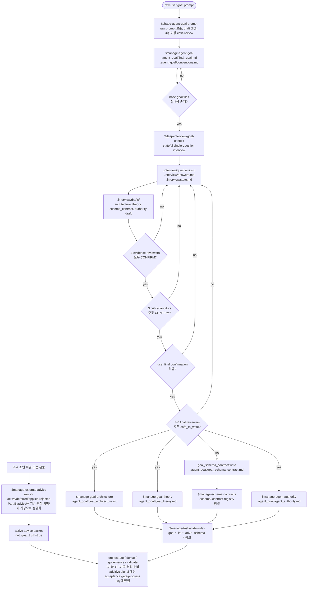
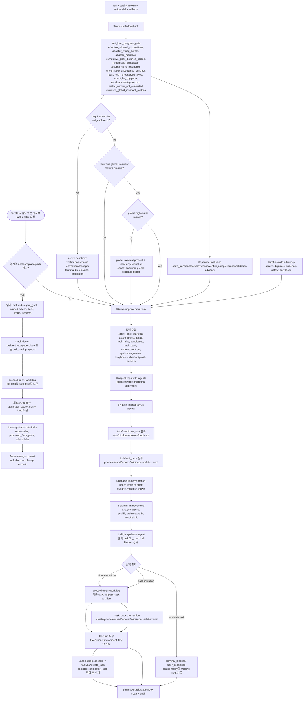
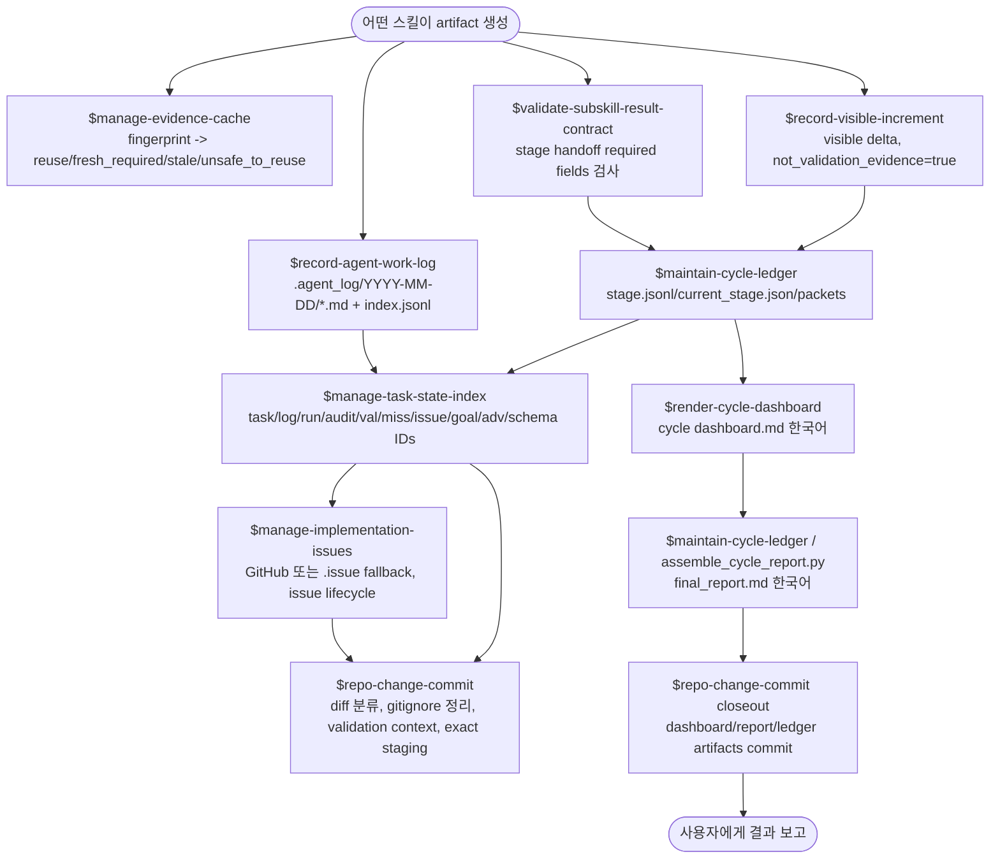
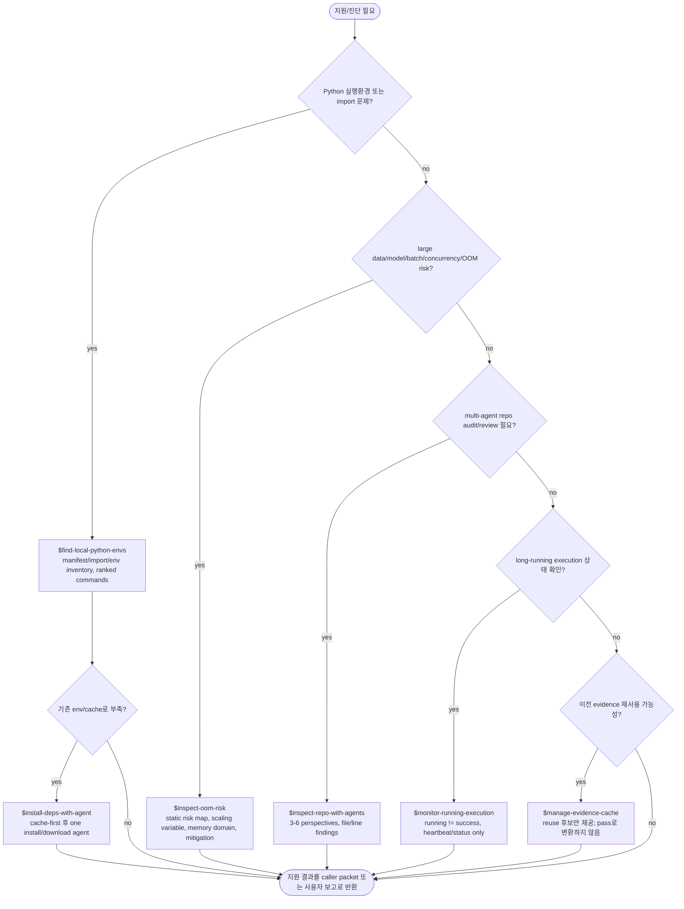

개인적으로 만든 워크플로우 목적의 스킬 모음입니다.

생각날때 업데이트합니다.

## Skill 작동 흐름도

이 섹션은 각 스킬이 어떤 입력을 읽고, 어떤 판단을 하며, 어떤 산출물을 만들고, 어느 다음 스킬로 넘어가는지 확인하기 위한 흐름도이다.

- Mermaid 블록은 렌더링 가능한 다이어그램이다.
- 순수 텍스트 블록은 Mermaid 렌더링 없이도 같은 논리를 읽을 수 있는 흐름도이다.
- `.agent_goal/*.md`는 장기 목표/권한/규칙의 GT로 취급한다.
- `.agent_advice/*`는 비-GT 방향성 문서로만 취급한다.
- `.task/*`, `.agent_log/*`, `.issue/*`, `.schema/*`, `.contract/*`, `.validation/*`는 워크플로우 증거와 추적 상태이다.
- 완료 판정은 `$validate-task-completion`이 담당하며, 실행 성공/로그/대시보드/인덱스만으로 완료를 선언하지 않는다.
- adapter나 caller가 verifier contract를 요구하는 measurable acceptance는 live verifier가 pass해야 완전하다. required verifier의 `not_evaluated`는 pass가 아니며, full close 대신 verifier follow-up, explicit descope, terminal blocker, user escalation 중 하나로 보존한다.
- acceptance가 참조하는 gate의 required hook 부재, `pass_with_unobserved_axes`, generation-dependent count key, below-policy residual value per cycle cost는 pass/advance/close 근거가 아니다. hook supply, axis supply, effective key/terminal-outcome fallback, residual descope plus next rung, terminal blocker, user escalation 중 하나로 보존한다.
- 구조 진전은 어댑터가 `structure_metrics.global_*` 전역 불변량을 제공하면 per-scope 감소가 아니라 global high-water 이동으로 판정한다.

### Mermaid Flowchart 1: 전체 task cycle orchestration

```mermaid
flowchart TD
  Start([사용자 요청 또는 cycle 시작])
  Context["context 수집<br/>README, task.md, .agent_goal, .task, .issue, .schema"]
  LedgerInit["$maintain-cycle-ledger<br/>cycle-id, stage.jsonl, current_stage.json, packets/ 초기화"]
  Authority["$manage-agent-authority<br/>권한/외부 호출/검증 우선순위 정책 요약"]
  Acceptance["$normalize-acceptance-and-demo<br/>acceptance, non-goals, demo, validation commands 정규화<br/>measurable -> verifier contract when mapped<br/>required gate hook absent -> unverifiable_acceptance_contract"]
  AdapterScan["repo-local skill adapter scan<br/>code_convention_contract, domain adapter, output-delta hook,<br/>target_required_verifier, goal_axis_map,<br/>count-key collapse, structure_metrics.global_* 탐색"]
  RoutePlan["route_plan<br/>task.md 존재 여부와 cycle 경로 결정"]

  NoTask{"task.md 없음?"}
  DeriveInitial["$derive-improvement-task initial_init<br/>초기 task.md 생성"]
  SchemaPreInit["$manage-schema-contracts<br/>초기 task가 schema/contract 영향이면 계약 정렬"]

  ValPlan["$plan-validation-scope<br/>current_only / affected_chain / full_chain 결정"]
  ValSetPlan["$build-validation-set-with-agents plan<br/>검증셋 필요 여부, oracle/split/leakage 정책"]
  Governance["$task-md-agent-governance<br/>task.md 구현, worker 위임, repo audit, task_miss 기록"]
  ResultContract1["$validate-subskill-result-contract<br/>governance/result fields 검사"]
  CodeStructure["orchestrate scripts/code_structure_audit.py<br/>구조/컨벤션/semantic modularity audit packet"]
  Run["$run-task-code-and-log<br/>명령 실행, 실패 autopsy, observed_producer_claim downgrade, .agent_log 기록"]
  Running{"run status = running?"}
  Monitor["$monitor-running-execution<br/>PID/log/heartbeat/stop command 추적"]
  Quality["$review-cycle-output-quality<br/>단일 read-only xhigh 출력 품질 리뷰<br/>zero mapped goal axes -> pass_with_unobserved_axes"]
  Loopback["$audit-cycle-loopback<br/>semantic_progress, same-family loop, adapter metrics,<br/>3-state gates, verifier contract, count-key hygiene,<br/>goal-axis completeness, residual cost ratio"]
  ValSetBuild["$build-validation-set-with-agents build/consume<br/>validation assets 또는 oracle 결과 산출"]
  SchemaPreDerive["$manage-schema-contracts pre-derive<br/>schema/contract 영향과 stale contract 확인"]
  Visible["$record-visible-increment<br/>보이는 변화 기록; not_validation_evidence=true"]
  GapAnalysis["repo_skill_gap_analysis<br/>adapter/skill gap 또는 skill-creator 후보"]
  Profile["$profile-cycle-efficiency<br/>중복 로그, metadata-only 반복, command surface budget 감지"]
  Slice["$optimize-task-slice<br/>state_transition, batch, evidence_supply, verifier_completion, consolidation 등 advisory"]
  DeriveNext["$derive-improvement-task<br/>다음 task.md 또는 task_pack/terminal blocker 도출"]
  SchemaPost["$manage-schema-contracts post-derive<br/>새 task/schema/contract 링크 정리"]
  Index["$manage-task-state-index<br/>scan, link, audit; task/candidate/miss/log/schema/issue IDs"]
  Validate["$validate-task-completion<br/>complete / partial / failed + progress_verdict<br/>required verifier pass + structure global effect 확인"]
  Issue["$manage-implementation-issues<br/>issue open/update/resolve, .issue mirror, GitHub fallback"]
  Commit["$repo-change-commit<br/>coherent implementation/checkpoint commit"]
  Dashboard["$render-cycle-dashboard<br/>한국어 dashboard.md"]
  Report["$maintain-cycle-ledger / assemble_cycle_report.py<br/>한국어 final_report.md"]
  Closeout["$repo-change-commit closeout<br/>report/dashboard/ledger closeout commit"]
  End([cycle 결과 보고])

  Start --> Context --> LedgerInit --> Authority --> Acceptance --> AdapterScan --> RoutePlan --> NoTask
  NoTask -- yes --> DeriveInitial --> SchemaPreInit --> ValPlan
  NoTask -- no --> ValPlan
  ValPlan --> ValSetPlan --> Governance --> ResultContract1 --> CodeStructure --> Run --> Running
  Running -- yes --> Monitor --> Validate
  Running -- no --> Quality --> Loopback --> ValSetBuild --> SchemaPreDerive --> Visible --> GapAnalysis --> Profile --> Slice --> DeriveNext --> SchemaPost --> Index --> Validate
  Validate --> Issue --> Commit --> Dashboard --> Report --> Closeout --> End
```



### Mermaid Flowchart 2: goal, authority, interview, advice



### Mermaid Flowchart 3: task selection, doctoring, task-pack, anti-loop



### Mermaid Flowchart 4: implementation, execution, validation

```mermaid
flowchart TD
  Task([active task.md])
  Acceptance["$normalize-acceptance-and-demo<br/>acceptance packet<br/>envelope + acceptance_verifier_contract<br/>required hook completeness"]
  ValScope["$plan-validation-scope<br/>changed surfaces -> current_only/affected_chain/full_chain"]
  EnvNeed{"Python/dependency constrained?"}
  FindEnv["$find-local-python-envs<br/>local env inventory, ranked run commands"]
  DepMissing{"필수 dependency/cache 없음?"}
  Install["$install-deps-with-agent<br/>find-local-python-envs 후 exactly one install agent"]
  ValSetNeed{"validation set 필요?"}
  ValSet["$build-validation-set-with-agents<br/>plan/build/consume, .validation assets"]
  Governance["$task-md-agent-governance"]
  ReadTask["task.md, authority, advice, schema, code_convention_contract 읽기"]
  MapRepo["repo map<br/>git status, rg --files, manifests, tests"]
  Workers["gpt-5.5 worker agents<br/>disjoint write scopes, authority/advice/convention 포함"]
  Integrate["worker changes 통합<br/>format/tests, convention_conformance 확인"]
  Inspect["$inspect-repo-with-agents<br/>3-6 read-only code/schema/authority/generalization audit"]
  TaskMiss[".task/task_miss report<br/>miss/resolved/deleted cleanup evidence"]
  Run["$run-task-code-and-log"]
  Execute["정해진 command 실행<br/>validation_profile 준수"]
  Failure{"실패 또는 gate unsatisfiable?"}
  Autopsy["safe_failure_autopsy.py<br/>scalar diagnostics, self_inflicted_gate_defect 분류"]
  Log["$record-agent-work-log<br/>.agent_log + run evidence"]
  Running{"long-running authorized?"}
  Monitor["$monitor-running-execution<br/>PID/log/heartbeat/status"]
  Quality["$review-cycle-output-quality<br/>single reviewer, output quality/delta/no-overclaim<br/>goal-axis completeness"]
  Completion["$validate-task-completion"]
  Gates["gates: env, execution, repo audit, OOM if relevant,<br/>task_miss, issue, advice, schema, acceptance,<br/>required verifier/hook pass, goal axes,<br/>count-key hygiene, residual cost ratio,<br/>structure global invariant, behavior-change live evidence, ID"]
  Verdict{"validation_verdict<br/>complete / partial / failed"}
  Progress{"progress_verdict<br/>advanced / safety_only / no_progress / regressed"}

  Task --> Acceptance --> ValScope --> EnvNeed
  EnvNeed -- yes --> FindEnv --> DepMissing
  DepMissing -- yes --> Install --> ValSetNeed
  DepMissing -- no --> ValSetNeed
  EnvNeed -- no --> ValSetNeed
  ValSetNeed -- yes --> ValSet --> Governance
  ValSetNeed -- no --> Governance
  Governance --> ReadTask --> MapRepo --> Workers --> Integrate --> Inspect --> TaskMiss --> Run
  Run --> Execute --> Failure
  Failure -- yes --> Autopsy --> Log
  Failure -- no --> Log
  Log --> Running
  Running -- yes --> Monitor --> Completion
  Running -- no --> Quality --> Completion
  Completion --> Gates --> Verdict --> Progress
```



### Mermaid Flowchart 5: evidence, state, issue, commit, reporting



### Mermaid Flowchart 6: diagnostic and support skills



## 순수 텍스트 Flowchart

아래 블록은 Mermaid 렌더링 없이도 구조가 보이도록 박스, 분기, 화살표만으로 그린 텍스트 도형이다.

### Text Flowchart 1: 전체 cycle

```text
+--------------------------------------------------------------------------------+
| USER REQUEST / CYCLE START                                                     |
+--------------------------------------------------------------------------------+
        |
        v
+--------------------------------------------------------------------------------+
| CONTEXT                                                                        |
| - README, task.md, .agent_goal, .task, .issue, .schema, .contract 확인          |
+--------------------------------------------------------------------------------+
        |
        v
+----------------------------+     +---------------------------------------------+
| $maintain-cycle-ledger     | --> | .task/cycle/<cycle-id>/                    |
| cycle id / stage ledger    |     | stage.jsonl, current_stage.json, packets/  |
+----------------------------+     +---------------------------------------------+
        |
        v
+----------------------------+     +---------------------------------------------+
| $manage-agent-authority    | --> | authority_policy                           |
| 권한/외부호출/검증 우선순위 |     | agent_authority.md or default permissions   |
+----------------------------+     +---------------------------------------------+
        |
        v
+----------------------------+     +---------------------------------------------+
| $normalize-acceptance      | --> | acceptance packet                           |
| acceptance/non-goal/demo   |     | envelope_floor / deficit_axis when present  |
| measurable target contract |     | acceptance_verifier_contract when mapped    |
|                             |     | required verifier/hook not_evaluated != pass|
+----------------------------+     +---------------------------------------------+
        |
        v
+----------------------------+     +---------------------------------------------+
| repo-local adapter scan    | --> | code_convention_contract                    |
| adapters and hooks         |     | domain adapter / output-delta / gate hooks  |
|                             |     | target_required_verifier, goal_axis_map,    |
|                             |     | count-key collapse, global_* metrics        |
+----------------------------+     +---------------------------------------------+
        |
        v
      +--------------------+
      | task.md exists ?   |
      +--------------------+
        | yes                                      | no
        v                                          v
+----------------------------+       +-------------------------------------------+
| continue active task       |       | $derive-improvement-task initial_init     |
| 기존 task.md로 진행        |       | initial task.md 생성                       |
+----------------------------+       +-------------------------------------------+
        |                                          |
        +----------------------+-------------------+
                               |
                               v
+----------------------------+     +---------------------------------------------+
| $plan-validation-scope     | --> | validation_profile                         |
| changed surfaces classify  |     | current_only / affected_chain / full_chain |
+----------------------------+     +---------------------------------------------+
        |
        v
+----------------------------+     +---------------------------------------------+
| $build-validation-set      | --> | validation-set plan                         |
| plan mode                  |     | oracle / split / leakage / label policy    |
+----------------------------+     +---------------------------------------------+
        |
        v
+----------------------------+     +---------------------------------------------+
| $task-md-agent-governance  | --> | implementation + audit + task_miss         |
| worker implementation      |     | worker outputs, repo audit, miss reports   |
+----------------------------+     +---------------------------------------------+
        |
        v
+----------------------------+     +---------------------------------------------+
| result contract + structure| --> | validated handoff + structure packet       |
| field check / code audit   |     | required fields, shard/coupling/depth      |
+----------------------------+     +---------------------------------------------+
        |
        v
+----------------------------+     +---------------------------------------------+
| $run-task-code-and-log     | --> | run result + .agent_log                    |
| command execution          |     | success/running/partial/failed/not_run     |
+----------------------------+     +---------------------------------------------+
        |
        v
      +--------------------+
      | run is running ?   |
      +--------------------+
        | yes                                      | no
        v                                          v
+----------------------------+       +-------------------------------------------+
| $monitor-running-execution |       | $review-cycle-output-quality              |
| PID/log/heartbeat only     |       | single read-only quality reviewer          |
| running != success         |       +-------------------------------------------+
+----------------------------+                         |
        |                                              v
        |                                +---------------------------------------+
        |                                | $audit-cycle-loopback                 |
        |                                | semantic_progress / anti-loop gates    |
        |                                | pass/fail/not_evaluated gate meaning  |
        |                                | verifier debt + count-key hygiene      |
        |                                | goal-axis completeness + residual cost |
        |                                | global invariant keys                  |
        |                                +---------------------------------------+
        |                                              |
        |                                              v
        |                                +---------------------------------------+
        |                                | validation build + schema + increment |
        |                                | $build-validation-set build/consume   |
        |                                | $manage-schema-contracts pre-derive   |
        |                                | $record-visible-increment             |
        |                                +---------------------------------------+
        |                                              |
        |                                              v
        |                                +---------------------------------------+
        |                                | derive preparation                    |
        |                                | $profile-cycle-efficiency             |
        |                                | $optimize-task-slice                  |
        |                                | verifier_completion when required     |
        |                                | $derive-improvement-task              |
        |                                | $manage-schema-contracts post-derive  |
        |                                | $manage-task-state-index              |
        |                                +---------------------------------------+
        |                                              |
        +----------------------+-----------------------+
                               |
                               v
+----------------------------+     +---------------------------------------------+
| $validate-task-completion  | --> | validation_verdict + progress_verdict      |
| final completion gate      |     | complete/partial/failed + progress class   |
|                             |     | required verifier pass before full close    |
|                             |     | global structure target not consumed local  |
+----------------------------+     +---------------------------------------------+
        |
        v
+----------------------------+     +---------------------------------------------+
| issue -> commit -> report  | --> | $manage-implementation-issues              |
| final workflow closeout    |     | $repo-change-commit                        |
|                            |     | $render-cycle-dashboard / final_report.md  |
|                            |     | closeout commit                            |
+----------------------------+     +---------------------------------------------+
        |
        v
+--------------------------------------------------------------------------------+
| USER REPORT                                                                    |
+--------------------------------------------------------------------------------+
```

### Text Flowchart 2: 목표/권한/인터뷰 계열

```text
+-------------------------------+
| raw user goal prompt          |
+-------------------------------+
              |
              v
+-------------------------------+      +----------------------------------------+
| $shape-agent-goal-prompt      | ---> | draft final_goal.md / conventions.md  |
| preserve raw prompt           |      | 3+ critics: intent/overreach/risk     |
+-------------------------------+      +----------------------------------------+
              |
              v
+-------------------------------+      +----------------------------------------+
| $manage-agent-goal            | ---> | .agent_goal/final_goal.md             |
| merge supported goal truth    |      | .agent_goal/conventions.md            |
+-------------------------------+      +----------------------------------------+
              |
              v
          +-------------------------------+
          | base goal files complete ?    |
          | final_goal + conventions      |
          +-------------------------------+
              | yes                                | no
              v                                    v
+-------------------------------+       +----------------------------------------+
| $deep-interview-goal-context  |       | return to $manage-agent-goal          |
| stateful one-question loop    |       | prerequisite objective/conventions    |
+-------------------------------+       +----------------------------------------+
              |
              v
+-------------------------------+      +----------------------------------------+
| .interview/questions/answers  | ---> | one pending question per invocation   |
| state.md tracks active batch  |      | answers become interview evidence     |
+-------------------------------+      +----------------------------------------+
              |
              v
+-------------------------------+      +----------------------------------------+
| .interview/drafts             | ---> | draft architecture/theory/schema/     |
| not final goal truth          |      | authority files                       |
+-------------------------------+      +----------------------------------------+
              |
              v
        +-----------------------------+
        | 3 evidence reviewers CONFIRM?|
        +-----------------------------+
              | yes                                | no
              v                                    v
        +-----------------------------+      +-------------------------------+
        | 3 critical auditors CONFIRM?|      | revise drafts or ask next     |
        +-----------------------------+      | targeted question             |
              | yes                         +-------------------------------+
              v
        +-----------------------------+
        | user final confirmation ?   |
        +-----------------------------+
              | yes                                | no
              v                                    v
        +-----------------------------+      +-------------------------------+
        | 3-6 final reviewers safe ?  |      | hold writes; ask/record       |
        +-----------------------------+      | missing confirmation          |
              | yes                         +-------------------------------+
              v
+-------------------------------+      +----------------------------------------+
| final .agent_goal writes      | ---> | goal_architecture.md                  |
| all-or-nothing after confirm  |      | goal_theory.md                        |
|                               |      | goal_schema_contract.md               |
|                               |      | agent_authority.md                    |
+-------------------------------+      +----------------------------------------+
              |
              v
+-------------------------------+      +----------------------------------------+
| $manage-schema-contracts      | ---> | .schema/.contract aligned to          |
| $manage-task-state-index      |      | goal_schema_contract; goal/int IDs    |
+-------------------------------+      +----------------------------------------+

External advice side path:

+-------------------------------+      +----------------------------------------+
| external advice Markdown      | ---> | $manage-external-advice               |
+-------------------------------+      | raw -> active/deferred/applied/rejected|
                                       | workflow advice becomes in-place      |
                                       | acceptance/gate/progress-key revision |
                                       +----------------------------------------+
                                                     |
                                                     v
                                       +----------------------------------------+
                                       | active advice packet                   |
                                       | not_goal_truth=true                    |
                                       | consumed by orchestrate/derive/        |
                                       | governance/validate only as non-GT     |
                                       +----------------------------------------+
```

### Text Flowchart 3: task 생성/수정/선택 계열

```text
+-------------------------------+
| next task needed              |
| or explicit task doctor input |
+-------------------------------+
              |
              v
        +-----------------------------+
        | explicit doctor/pack/retarget?|
        +-----------------------------+
          | yes                                      | no
          v                                          v
+-------------------------------+        +---------------------------------------+
| $task-doctor                  |        | $derive-improvement-task              |
| pre-cycle intervention only   |        | normal next-task selection            |
+-------------------------------+        +---------------------------------------+
          |                                          |
          v                                          v
+-------------------------------+        +---------------------------------------+
| read direction sources        |        | load planning context                 |
| user instruction, task.md,    |        | .agent_goal, authority, advice,       |
| .agent_goal, named advice,    |        | .issue, task_miss, candidates,        |
| .task, .issue, schema         |        | task_pack, schema, review, loopback   |
+-------------------------------+        +---------------------------------------+
          |                                          |
          v                                          v
+-------------------------------+        +---------------------------------------+
| archive old task              |        | analysis fanout                       |
| $record-agent-work-log        |        | - goal/schema alignment audit         |
| past_task before overwrite    |        | - 2-4 task_miss agents                |
+-------------------------------+        | - candidate scan                      |
          |                              | - task_pack scan                      |
          v                              | - 1 issue-fit agent                   |
+-------------------------------+        | - 3 improvement agents                |
| write task.md or task_pack    |        | - 1 synthesis agent                   |
| preserve scope_fidelity,      |        +---------------------------------------+
| envelope, verifier contract,  |                         |
| terminal/global residuals,    |                         |
| G-axis/cost residuals         |                         |
+-------------------------------+                         v
          |                              +---------------------------------------+
          v                              | apply hard selection gates            |
+-------------------------------+        | anti_loop effective dispositions,     |
| index / schema / issue /      |        | allowed_task_kinds, adapter defects,  |
| advice reconciliation         |        | chain stalls, sealed families,        |
+-------------------------------+        | verifier debt, count-key hygiene,     |
                                         | goal-axis, residual cost, global keys |
          |                              | no producer self-report truth         |
          |                              +---------------------------------------+
          v                                               |
+-------------------------------+                         v
| optional task-direction commit|        +---------------------------------------+
| $repo-change-commit           |        | synthesis decision                    |
+-------------------------------+        +---------------------------------------+
          |                                      | standalone task
          |                                      v
          |                         +----------------------------------+
          |                         | archive old task -> write task.md |
          |                         | keep/delete candidates safely     |
          |                         +----------------------------------+
          |                                      |
          |                                      | pack mutation
          |                                      v
          |                         +----------------------------------+
          |                         | create/promote/insert/reorder/   |
          |                         | skip/supersede task_pack + task  |
          |                         +----------------------------------+
          |                                      |
          |                                      | no viable task
          |                                      v
          |                         +----------------------------------+
          |                         | terminal_blocker / user_escalation|
          |                         | sealed family + missing input     |
          |                         +----------------------------------+
          |                                      |
          +---------------------------+----------+
                                      |
                                      v
                         +----------------------------------+
                         | $manage-task-state-index         |
                         | scan + link + audit              |
                         +----------------------------------+

Anti-loop and efficiency inputs into derive:

+-------------------------------+      +----------------------------------------+
| run + quality + output-delta  | ---> | $audit-cycle-loopback                  |
+-------------------------------+      | semantic_progress, root family,        |
                                       | adapter metrics, effective dispositions|
                                       | evaluation_status pass/fail/not_eval   |
                                       | target_required_verifier + goal_axis   |
                                       | count-key hygiene + residual cost      |
                                       | global_*                               |
                                       +----------------------------------------+
                                                     |
                                                     v
                                       +----------------------------------------+
                                       | $optimize-task-slice                  |
                                       | state_transition / batch / evidence / |
                                       | verifier_completion / consolidation / |
                                       | stop advisory                         |
                                       +----------------------------------------+
                                                     |
                                                     v
                                       +----------------------------------------+
                                       | $profile-cycle-efficiency             |
                                       | duplicate evidence, metadata-only,    |
                                       | safety_only loops, sprawl budgets     |
                                       +----------------------------------------+
```

### Text Flowchart 4: 구현/실행/검증 계열

```text
+-------------------------------+
| active task.md                |
+-------------------------------+
              |
              v
+-------------------------------+      +----------------------------------------+
| $normalize-acceptance         | ---> | acceptance packet                      |
| criteria / non-goals / demo   |      | validation commands + envelope         |
| measurable -> verifiable      |      | acceptance_verifier_contract           |
|                               |      | when mapped                            |
+-------------------------------+      +----------------------------------------+
              |
              v
+-------------------------------+      +----------------------------------------+
| $plan-validation-scope        | ---> | validation_profile                     |
| changed surface classification|      | current_only / affected_chain / full   |
+-------------------------------+      +----------------------------------------+
              |
              v
        +-----------------------------+
        | Python/env dependency need? |
        +-----------------------------+
          | yes                                      | no
          v                                          v
+-------------------------------+        +---------------------------------------+
| $find-local-python-envs       |        | skip env discovery                    |
| rank existing env commands    |        +---------------------------------------+
+-------------------------------+                         |
          |                                                |
          v                                                |
        +-----------------------------+                    |
        | missing dependency/cache ?  |                    |
        +-----------------------------+                    |
          | yes               | no                         |
          v                   v                            |
+-------------------+   +-------------------+              |
| $install-deps     |   | use ranked env    |              |
| one install agent |   | no install        |              |
+-------------------+   +-------------------+              |
          |                   |                            |
          +---------+---------+----------------------------+
                    |
                    v
        +-----------------------------+
        | validation set needed ?     |
        +-----------------------------+
          | yes                                      | no
          v                                          v
+-------------------------------+        +---------------------------------------+
| $build-validation-set         |        | continue to governance                |
| plan/build/consume assets     |        +---------------------------------------+
+-------------------------------+                         |
          |                                                |
          +--------------------------+---------------------+
                                     |
                                     v
+-------------------------------+      +----------------------------------------+
| $task-md-agent-governance     | ---> | implementation outputs                |
| read task/authority/advice/   |      | worker changes + integration          |
| schema/convention contract    |      | repo audit + .task/task_miss          |
+-------------------------------+      +----------------------------------------+
              |
              v
+-------------------------------+      +----------------------------------------+
| $run-task-code-and-log        | ---> | run evidence + .agent_log             |
| execute specified command     |      | status: success/running/partial/failed|
+-------------------------------+      +----------------------------------------+
              |
              v
        +-----------------------------+
        | failure or gate unsatisfiable?|
        +-----------------------------+
          | yes                                      | no
          v                                          v
+-------------------------------+        +---------------------------------------+
| safe_failure_autopsy.py       |        | keep normal run evidence              |
| scalar diagnostics only       |        +---------------------------------------+
| self_inflicted_gate_defect    |                         |
+-------------------------------+                         |
          |                                                |
          +--------------------------+---------------------+
                                     |
                                     v
        +-----------------------------+
        | long-running authorized ?  |
        +-----------------------------+
          | yes                                      | no
          v                                          v
+-------------------------------+        +---------------------------------------+
| $monitor-running-execution    |        | $review-cycle-output-quality          |
| PID/log/heartbeat; not success|        | single read-only reviewer             |
+-------------------------------+        +---------------------------------------+
          |                                                |
          +--------------------------+---------------------+
                                     |
                                     v
+-------------------------------+      +----------------------------------------+
| $validate-task-completion     | ---> | validation_verdict                    |
| final gate matrix             |      | complete / partial / failed           |
| env/run/repo/OOM/miss/issue/  |      | progress_verdict: advanced /          |
| advice/schema/acceptance/ID   |      | safety_only / no_progress / regressed |
| verifier/structure global     |      | not_evaluated verifier blocks         |
|                               |      | complete                              |
+-------------------------------+      +----------------------------------------+
```

### Text Flowchart 5: 진단/환경/의존성 지원 계열

```text
+-------------------------------+
| support / diagnostic need     |
+-------------------------------+
              |
              v
        +-----------------------------+
        | Python import/env problem ? |
        +-----------------------------+
          | yes                                      | no
          v                                          v
+-------------------------------+        +---------------------------------------+
| $find-local-python-envs       |        | check OOM risk need                  |
| manifests + env inventory     |        +---------------------------------------+
| output: ranked run commands   |                         |
+-------------------------------+                         v
          |                                  +-----------------------------+
          v                                  | OOM/memory risk surface ?   |
        +-----------------------------+      +-----------------------------+
        | existing env/cache enough ? |        | yes                  | no
        +-----------------------------+        v                      v
          | yes              | no      +--------------------+   +------------------+
          v                  v        | $inspect-oom-risk |   | repo audit need ?|
+-------------------+  +-------------------+                +------------------+
| return command    |  | $install-deps     |                         |
| no install        |  | one setup agent   |                         v
+-------------------+  +-------------------+              +---------------------+
          |                  |                             | $inspect-repo-with  |
          +---------+--------+                             | -agents             |
                    |                                      | 3-6 perspectives    |
                    |                                      +---------------------+
                    |                                               |
                    |                                               v
                    |                                    +----------------------+
                    |                                    | running run check ?  |
                    |                                    +----------------------+
                    |                                      | yes            | no
                    |                                      v                v
                    |                           +-------------------+  +------------------+
                    |                           | $monitor-running |  | evidence reuse ? |
                    |                           | running != pass  |  +------------------+
                    |                           +-------------------+    | yes        | no
                    |                                      |             v            v
                    |                                      |  +-------------------+ +---------+
                    |                                      |  | $manage-evidence | | return  |
                    |                                      |  | -cache           | | support |
                    |                                      |  | reuse/stale only | | result  |
                    |                                      |  +-------------------+ +---------+
                    |                                      |             |
                    +--------------------------------------+-------------+
                                                   |
                                                   v
                                      +-----------------------------+
                                      | caller packet or user report|
                                      +-----------------------------+
```

### Text Flowchart 6: 상태/로그/이슈/커밋/보고 계열

```text
+-------------------------------+
| any skill creates evidence    |
| run/audit/validation/report   |
+-------------------------------+
              |
              v
+-------------------------------+      +----------------------------------------+
| $validate-subskill-result     | ---> | contract packet                        |
| required fields warn/block    |      | task_id, step, blockers, evidence     |
+-------------------------------+      +----------------------------------------+
              |
              v
+-------------------------------+      +----------------------------------------+
| $maintain-cycle-ledger        | ---> | .task/cycle/<cycle-id>/stage.jsonl    |
| append canonical stage event  |      | current_stage.json, packets/          |
+-------------------------------+      +----------------------------------------+
              |
              v
+-------------------------------+      +----------------------------------------+
| $record-agent-work-log        | ---> | .agent_log/YYYY-MM-DD/*.md            |
| factual intent/work/result/   |      | .agent_log/index.jsonl                |
| shortcomings                  |      | log-* IDs when indexed                |
+-------------------------------+      +----------------------------------------+
              |
              v
+-------------------------------+      +----------------------------------------+
| $manage-task-state-index      | ---> | .task/index.jsonl + index.md          |
| append-only IDs and links     |      | task/log/run/audit/val/miss/issue/    |
| global consistency audit      |      | goal/adv/schema IDs                   |
+-------------------------------+      +----------------------------------------+
              |
              v
+-------------------------------+      +----------------------------------------+
| $record-visible-increment     | ---> | .task/delta/<cycle-id>-visible-delta  |
| before/after user-visible     |      | not_validation_evidence=true          |
| workflow change only          |      | not a completion proof                |
+-------------------------------+      +----------------------------------------+
              |
              v
+-------------------------------+      +----------------------------------------+
| $manage-implementation-issues | ---> | GitHub issue or .issue/open|resolved  |
| issue open/update/resolve     |      | requires run/validation evidence      |
+-------------------------------+      +----------------------------------------+
              |
              v
+-------------------------------+      +----------------------------------------+
| $repo-change-commit           | ---> | commit hash or skip/block reason      |
| classify dirty worktree       |      | exact staging, validation context     |
| source/workflow/noise split   |      | safety_only/partial blockers in msg   |
+-------------------------------+      +----------------------------------------+
              |
              v
+-------------------------------+      +----------------------------------------+
| $render-cycle-dashboard       | ---> | dashboard.md in Korean                |
| stage/verdict/blocker summary |      | malformed/running/partial visible     |
+-------------------------------+      +----------------------------------------+
              |
              v
+-------------------------------+      +----------------------------------------+
| final_report + closeout commit| ---> | final_report.md + closeout commit     |
| Korean report, canonical IDs  |      | report/dashboard/ledger artifacts     |
+-------------------------------+      +----------------------------------------+
```

### 스킬별 빠른 참조

```text
orchestrate-task-cycle
  context -> ledger -> authority -> acceptance/verifier contracts -> adapter scan -> validation planning -> governance -> run -> review -> loopback -> derive -> index -> validate -> issue -> commit -> dashboard/report -> closeout

maintain-cycle-ledger
  cycle init -> stage append -> packet link -> dashboard/final_report render support

validate-subskill-result-contract
  subskill result -> required field check -> warn/block -> ledger event -> downstream warnings

manage-agent-goal
  user goal/conventions -> preserve/merge -> final_goal.md + conventions.md

shape-agent-goal-prompt
  raw prompt -> draft goal/conventions -> 3+ critics -> reconciled draft -> optional manage-agent-goal write

deep-interview-goal-context
  base goal gate -> one-question interview -> drafts -> evidence review -> audit -> user confirm -> final review -> four .agent_goal files

manage-goal-architecture
  repo map -> component responsibilities -> goal relevance -> goal_architecture.md

manage-goal-theory
  technical evidence -> mechanisms/assumptions/tradeoffs/validation logic -> goal_theory.md

manage-agent-authority
  context -> operation selection -> authority template -> safety validation -> authority summary/file

manage-schema-contracts
  goal schema contract + source/interfaces -> contract surfaces -> versions/causal map -> .schema/.contract updates

manage-external-advice
  raw advice -> normalize active advice -> in-place workflow revisions without GT upgrade -> audit stale/dead/degenerate claims -> apply/defer/reject -> adv-* links

derive-improvement-task
  context + agents + gates -> respect allowed dispositions, verifier debt, count-key hygiene, goal-axis completeness, residual cost, global invariant keys -> one next task/task_pack/terminal blocker -> archive old task -> write task.md -> index

task-doctor
  explicit doctor instruction -> read rules/task/advice -> archive old task -> rewrite task/task_pack while preserving verifier/hook/axis/cost/global residuals -> reconcile schema/index/issue -> optional commit

optimize-task-slice
  blockers/candidates/loop signals -> classify next slice including verifier_completion, hook_supply, axis_supply, cost_disproportionate_residual -> advisory packet for derive

profile-cycle-efficiency
  ledger/logs/validation/issues -> detect repeated low-value cycles/sprawl and supply residual value-per-cycle-cost denominator -> recommended action for derive/report

task-md-agent-governance
  task.md -> repo map -> worker implementation -> integration -> multi-agent audit -> task_miss report

inspect-repo-with-agents
  repo map -> 3-6 read-only perspectives -> verify severe claims -> findings/coverage/gaps

inspect-oom-risk
  repo/config/scale hints -> memory growth tracing -> severity findings -> mitigation

find-local-python-envs
  imports/manifests/env inventory -> rank environments -> exact run commands

install-deps-with-agent
  requirement -> find-local-python-envs -> cache check -> one install agent only if needed -> verification

plan-validation-scope
  changed surfaces -> current_only/affected_chain/full_chain -> validation manifest

normalize-acceptance-and-demo
  task context -> acceptance/non-goals/demo/validation packet -> envelope/verifier/hook contract and residual cost fields -> governance/validation scope

build-validation-set-with-agents
  task/evidence -> plan/build/refresh/consume/block -> .validation assets and result packet

run-task-code-and-log
  requested command -> execute/profile scope -> failure autopsy if needed -> .agent_log and run evidence

monitor-running-execution
  running run evidence -> heartbeat/status check -> running/completed/stale/missing_details/not_running

review-cycle-output-quality
  output artifacts -> one read-only qualitative reviewer -> quality/output-delta/no-overclaim/goal-axis packet

audit-cycle-loopback
  run/review/output-delta/adapter -> 3-state anti-loop gates, target_required_verifier, count-key hygiene, goal-axis completeness, residual cost, global invariant high-water -> registry/root-cause ledger -> derive constraints

validate-task-completion
  evidence bundle -> completion gates -> required verifier/hook pass + observed goal axes + count-key hygiene + residual cost ratio + structure global effect -> validation_verdict + progress_verdict -> validation report

manage-evidence-cache
  fingerprints -> reuse/fresh_required/stale/unsafe_to_reuse -> owning validator decides

manage-task-state-index
  artifacts -> append-only IDs/links/audit -> .task/index.jsonl + index.md

record-agent-work-log
  factual notes -> normalized log -> .agent_log entry -> optional task-state link

record-visible-increment
  before/after evidence -> visible delta artifact -> not validation evidence

manage-implementation-issues
  task/validation/blockers -> GitHub or .issue tracking -> issue lifecycle links

repo-change-commit
  dirty worktree + validation context -> classify/stage/commit coherent changes -> commit hash or blocker

render-cycle-dashboard
  cycle ledger -> Korean dashboard with canonical tokens and blockers
```
